# Features

This document provides a comprehensive overview of all pages and features available in the MyTravel application. The platform is divided into two main sections: the public-facing website for travelers and the administrative dashboard for platform management.

## Public Pages

### Homepage

**Route:** `/`

*"Explore the World with Ease"*

The homepage serves as the main entry point for visitors and establishes the MyTravel brand identity. A prominent hero section displays the website's name alongside a captivating tagline that invites users to begin their travel journey. The hero includes a search interface that allows users to quickly find destinations by location or keyword.

Below the hero, the page highlights top travel destinations with visually appealing cards showcasing popular locations. A testimonials section features reviews from satisfied travelers, building trust with new visitors. Promotional offers and seasonal deals are prominently displayed to encourage immediate engagement. A clear call-to-action button labeled "Plan Your Trip Now!" guides users toward the booking flow.

#### Screenshots

| Hero Section | Featured Destinations |
|:------------:|:---------------------:|
| 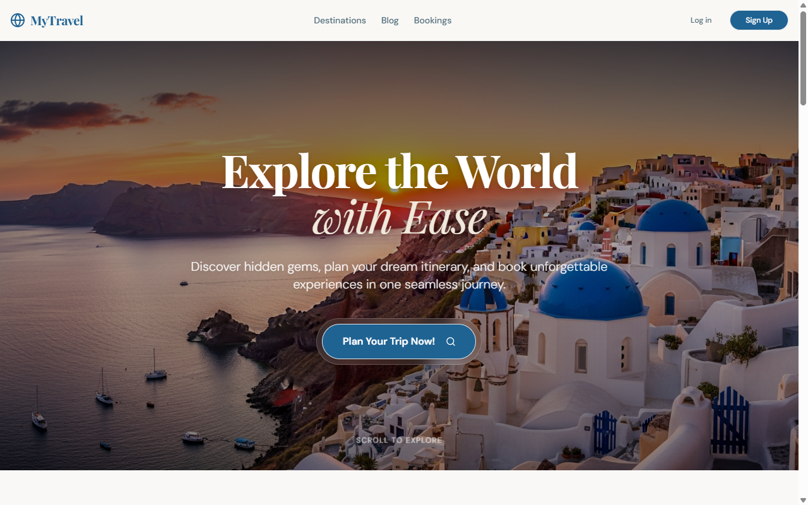 | 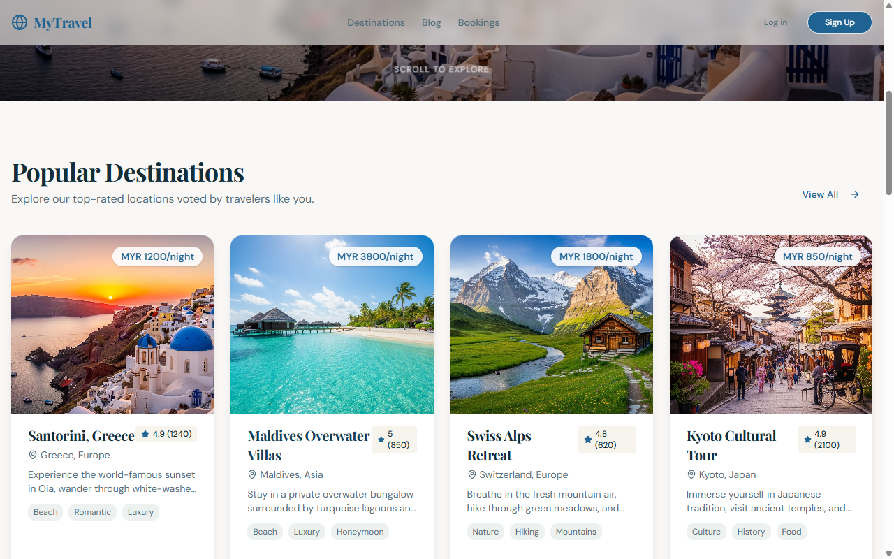 |
| *Hero with tagline and search* | *Top destination cards* |

| Testimonials | Call to Action Card |
|:------------:|:------------------:|
| 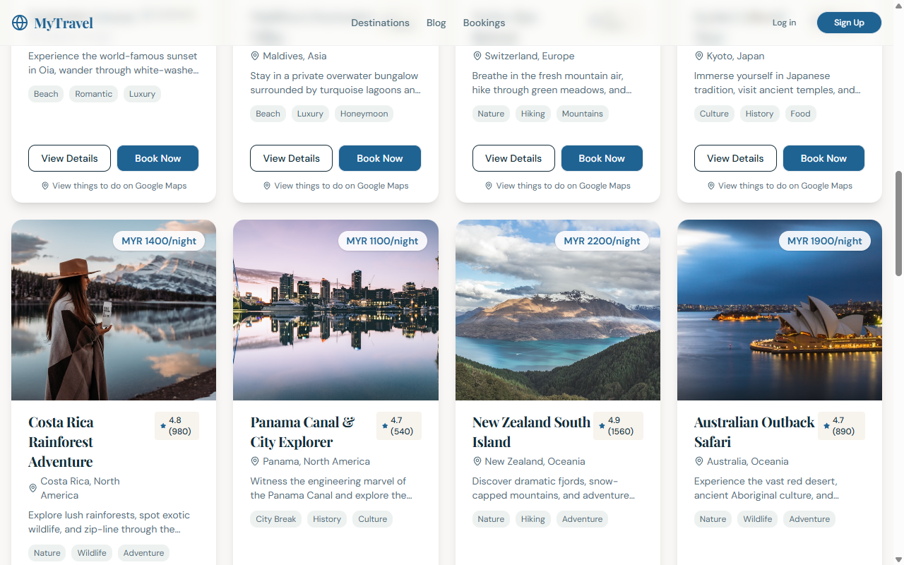 | 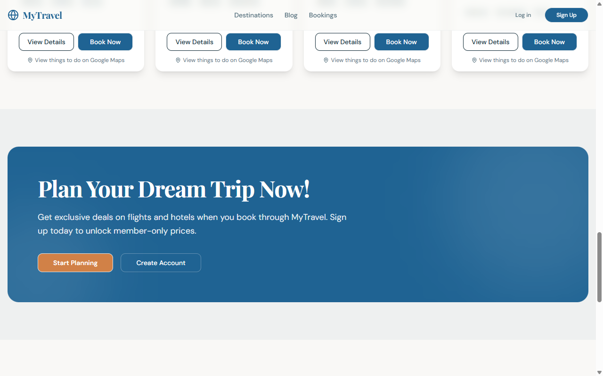 |
| *User reviews and ratings* | *Call to Action Card* |

### User Registration and Login

**Routes:** `/login`, `/register`

*"Create an account to access personalized travel deals."*

The authentication system provides secure access to personalized features and booking capabilities. The registration form collects essential information including email address, first name, last name, and password with confirmation. Form validation is handled client-side using react-hook-form integrated with Zod schemas, providing immediate feedback on input errors.

The login form accepts email and password credentials with options for password visibility toggle. Account verification is supported through email confirmation to ensure valid user accounts. A forgot password feature allows users to reset their credentials by receiving a password reset link via email. User sessions are managed through ASP.NET Core Identity with secure cookie-based authentication.

**Features:**
- Email-based registration with validation
- Account verification via email confirmation
- Forgot password functionality with email reset
- Secure session management
- Protected route redirection after login

#### Screenshots

| Login Form | Registration Form |
|:----------:|:-----------------:|
|  | 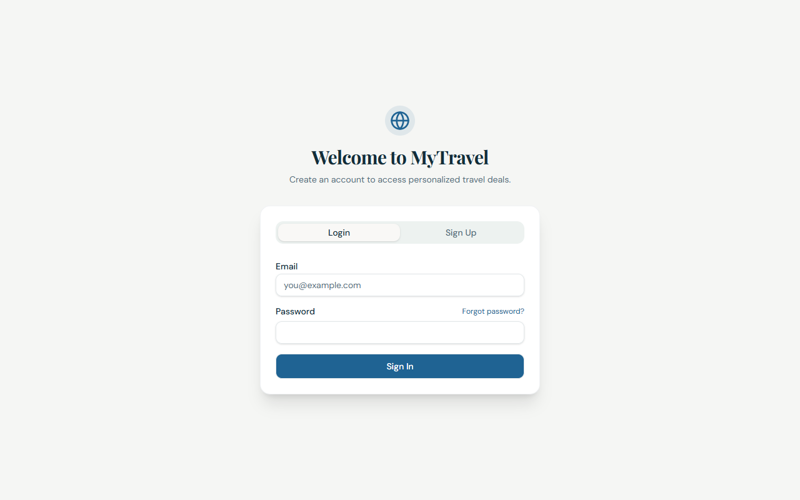 |
| *Email and password login* | *New account creation* |

| Password Recovery | Form Validation |
|:-----------------:|:---------------:|
| 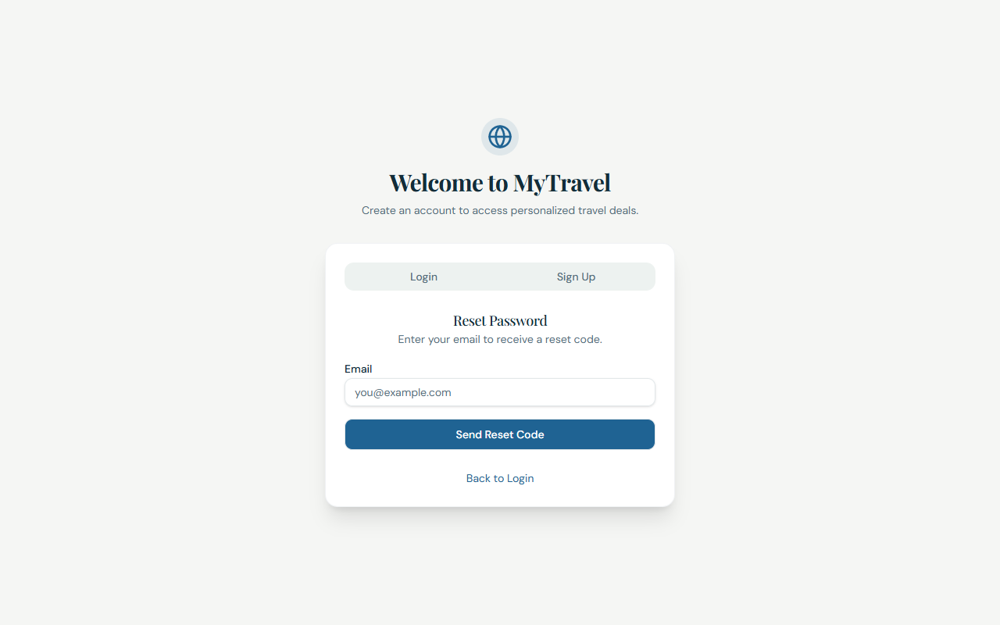 | 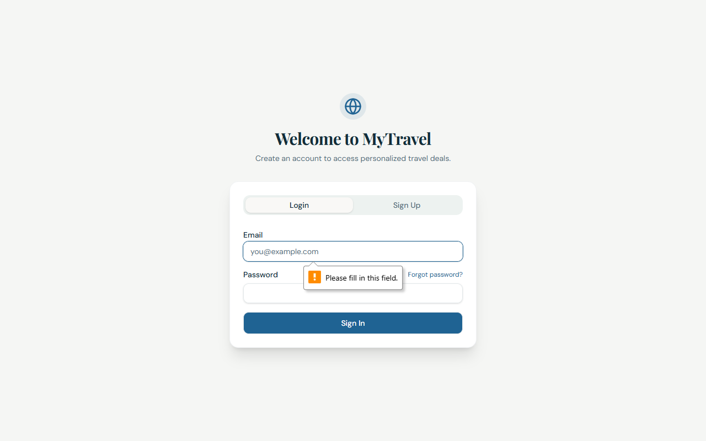 |
| *Password reset request* | *Real-time validation feedback* |

### Destination Browsing Page

**Route:** `/destinations`

*"Discover hidden gems across the world."*

The destinations page presents a comprehensive catalog of all available travel locations with rich visual content. Each destination is displayed as a card featuring high-quality images, descriptive text highlighting key attractions, and aggregated user reviews. Pricing information shows the starting cost to help users quickly assess options within their budget.

The page offers robust filtering capabilities to help users find their ideal destination. Filters are available for continent selection, activity type (beaches, hiking, cultural experiences, adventure sports), and budget range. Users can toggle between a traditional grid view for browsing and an interactive map view powered by Leaflet for geographical exploration. The search functionality allows users to find specific destinations by name or keyword.

**Filter Options:**
- Continent/Region selection
- Activity type (beaches, hiking, cultural, adventure)
- Budget range (economy, mid-range, luxury)
- Rating and review scores
- Seasonal availability

#### Screenshots

| Grid View | Map View |
|:---------:|:--------:|
|  |  |
| *Card-based destination browsing* | *Interactive Leaflet map view* |

| Filter Panel | Search Results |
|:------------:|:--------------:|
|  | 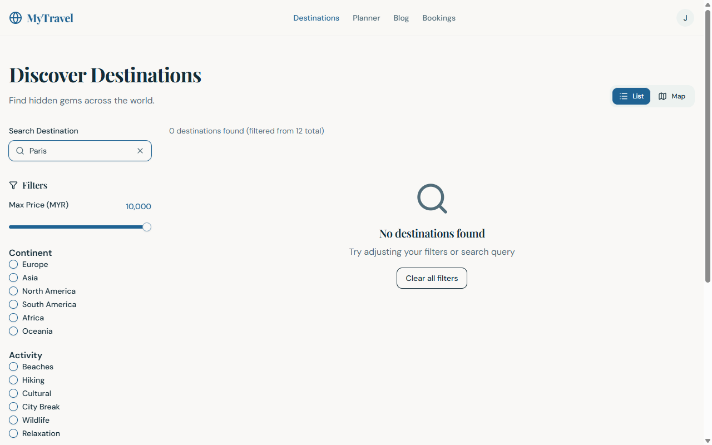 |
| *Continent, activity, and budget filters* | *Filtered destination results* |

### Destination Details

**Route:** `/destinations/:id`

Individual destination pages provide in-depth information about a specific location. The page opens with a gallery of high-quality images showcasing the destination's highlights. Detailed descriptions cover the location's history, culture, climate, and best times to visit.

Available activities are listed with descriptions and pricing, allowing users to plan their experiences. Accommodation options range from budget-friendly to luxury establishments. Users can add flights, hotels, or guided tours to their cart directly from this page, streamlining the booking process.

#### Screenshots

| Image Gallery | Description |
|:-------------:|:---------------------:|
| 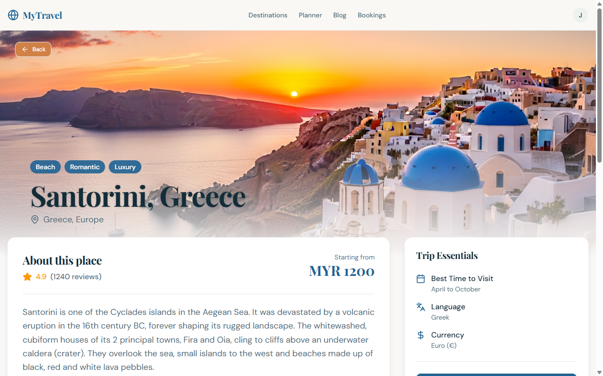 | 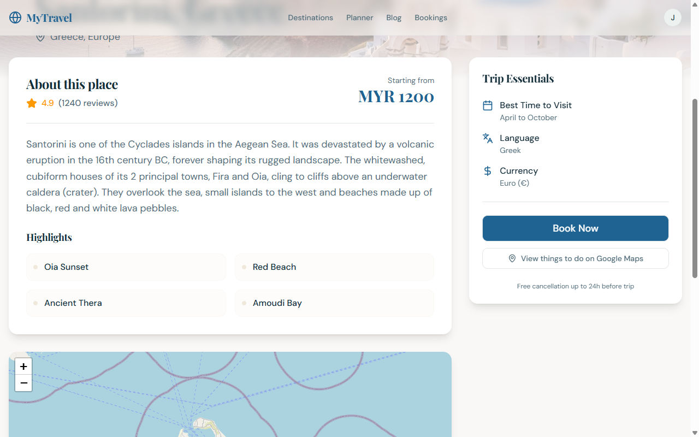 |
| *High-quality destination images* | *Details* |

| Available Activities and Map |
|:--------------------:|
| 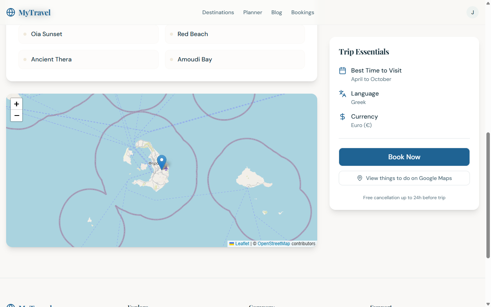 |
| *Tours and experiences* |

### Itinerary Planner

**Route:** `/planner`

*"Plan your dream trip effortlessly."*

The itinerary planner is an interactive tool that empowers authenticated (registered) users to create custom travel itineraries tailored to their preferences. The interface enables users to select places, accommodations, and activities, then organize them into a coherent travel plan.

The drag-and-drop functionality, powered by the dnd-kit library, allows users to easily arrange activities across different days of their trip. Users can reorder items, move activities between days, and visualize their complete journey timeline. The planner calculates estimated travel times between locations and provides running cost totals as items are added or removed.

**Features:**
- Drag-and-drop itinerary creation
- Day-by-day activity organization
- Estimated travel time calculations
- Running cost totals and budget tracking
- Export PDF

#### Screenshots

| Planner Page | Adding Activities |
|:-------------:|:-----------------:|
| 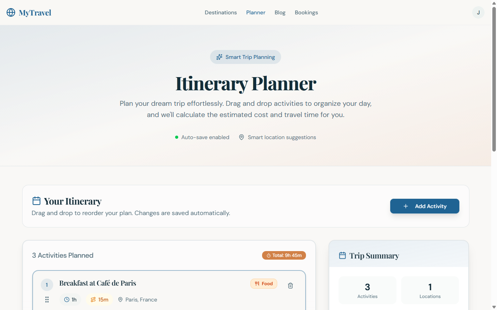 | 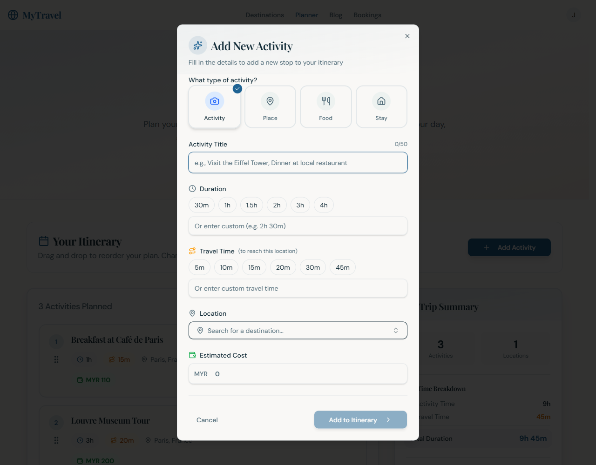 |
| *Planner Header* | *Selecting activities to add* |

| Itinerary |
|:-------------------:|
|  |
| *Activities*|

### Booking System

**Routes:** `/booking/:id`, `/checkout`

*"Book everything you need for your trip in one place."*

The booking system provides a unified interface for reserving all travel services. The booking page presents detailed forms for configuring reservations, including travel dates, number of travelers, and specific options such as room types, flight classes, or tour packages. Real-time availability checking ensures users only see bookable options.

The checkout page consolidates all items from the user's cart into a comprehensive order summary. An itemized breakdown displays each service with its details and pricing. The system calculates total costs including any applicable taxes and fees. Customer information collection includes contact details and any special requirements.

Payment processing is handled securely with real-time confirmation. Upon successful payment, users receive immediate booking confirmation displayed on screen and sent via email. The confirmation includes booking reference numbers, detailed itinerary information, and relevant contact details for each service provider.

**Features:**
- Integrated booking for flights, hotels, and tours
- Real-time availability and pricing
- Secure payment processing
- Instant booking confirmation
- Email confirmation with booking details
- Booking reference numbers for each service

#### Screenshots

| Booking Form | Date Selection |
|:------------:|:--------------:|
| 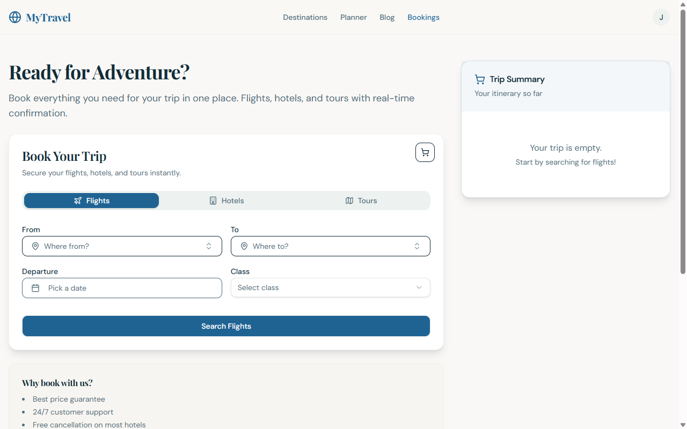 | 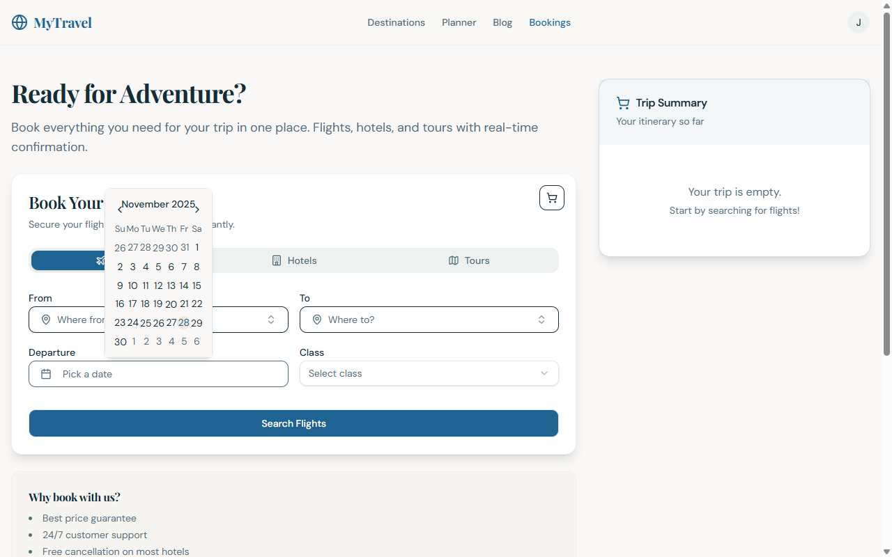 |
| *Service configuration options* | *Travel date selection* |

| Cart Summary | Checkout Page |
|:------------:|:-------------:|
| 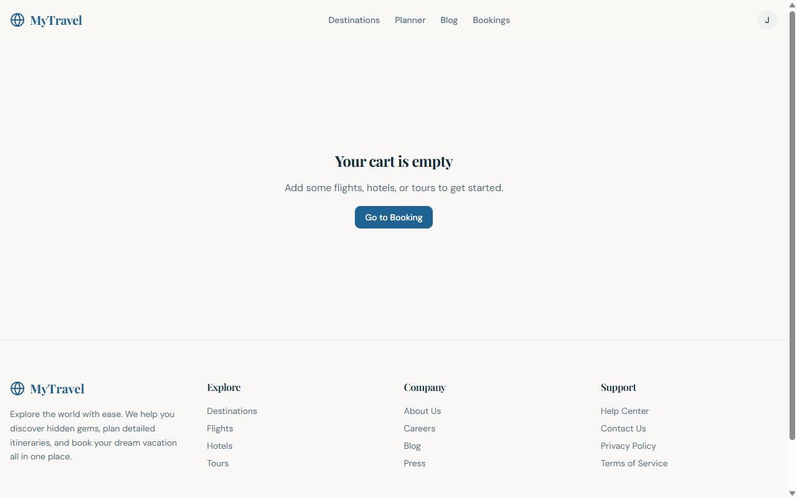 |  |
| *Itemized booking summary* | *Customer information entry* |

| Payment Processing | Confirmation |
|:------------------:|:------------:|
| 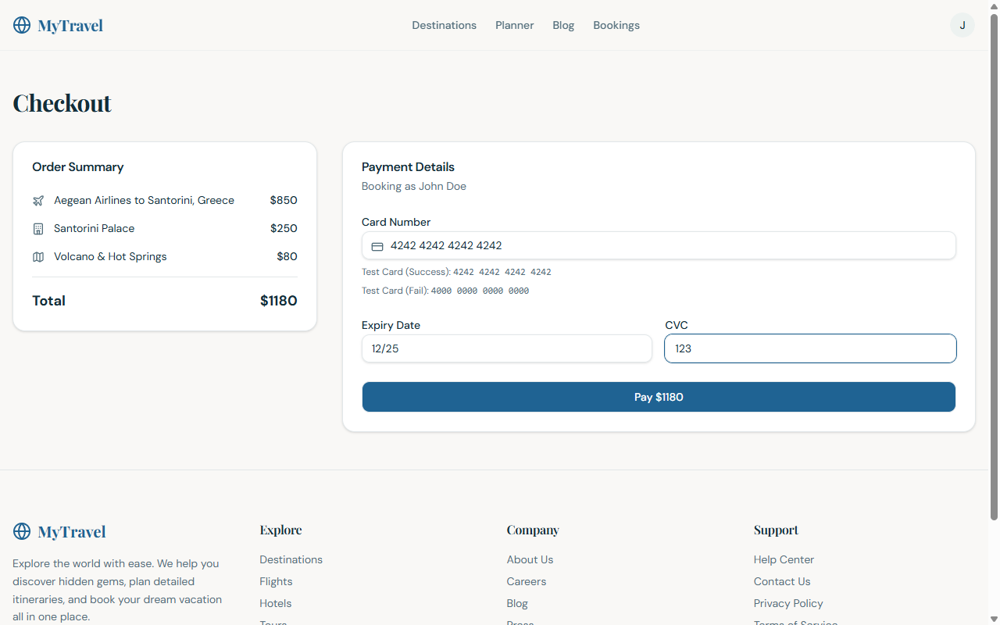 | 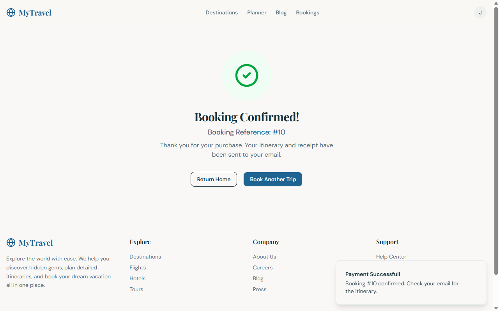 |
| *Secure payment form* | *Booking success with reference* |

### Interactive Map Integration

The application integrates interactive mapping capabilities using the Leaflet library with React-Leaflet bindings. Maps are featured prominently on the destinations browsing page, allowing users to explore travel locations geographically.

*"Explore destinations and travel routes on an interactive map."*

Users can pan and zoom across the world map, with destination markers indicating available locations. Clicking a marker reveals a popup with destination summary information and a link to the full details page. The map view provides an intuitive way to discover destinations by region and understand geographical relationships between locations.

On individual destination pages, maps display the specific location along with nearby points of interest, helping users understand the area and plan local exploration.

#### Screenshots

| World Map View |
|:--------------:|
|  |
| *Global destination overview* |

| Marker Popup | Destination Map |
|:------------:|:---------------:|
| 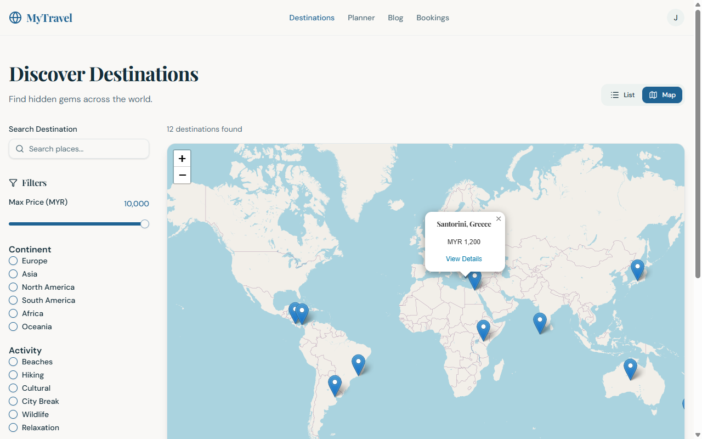 |  |
| *Quick destination info* | *Detailed location view* |

### Travel Blog

**Routes:** `/blog`, `/blog/:slug`, `/blog/new`, `/blog/edit/:slug`

*"Get inspired by amazing travel experiences."*

The blog section serves as a community-driven content hub where users can read and contribute travel stories, tips, and destination guides. The main blog page displays posts in a paginated list with preview cards showing titles, excerpts, featured images, and publication dates.

Content is organized into categories to help readers find relevant articles. Categories include solo travel adventures, family trip planning, luxury travel experiences, budget backpacking, cultural immersion, and adventure activities. Users can browse all posts or filter by their preferred category.

Individual blog posts are rendered with full rich text content using the Lexical editor's read mode. Articles support formatted text, headings, embedded images, and other media elements. Related posts are suggested at the bottom of each article to encourage continued exploration.

Authenticated users can contribute their own travel stories through the blog editor. The editor provides a rich text interface supporting formatted content, image uploads, and category selection. Authors can save drafts, preview their work, and publish when ready to share with the community.

**Content Categories:**
- Solo travel
- Family trips
- Luxury travel
- Budget backpacking
- Cultural experiences
- Adventure activities

#### Screenshots

| Blog Listing | Category Filter |
|:------------:|:---------------:|
|  | 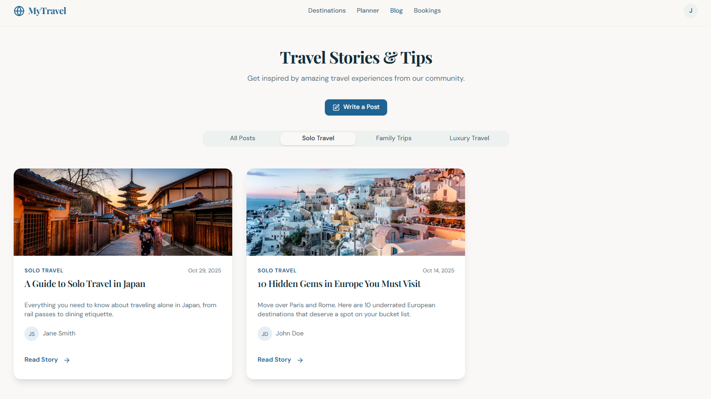 |
| *Paginated post cards* | *Filter by travel category* |

| Blog Post | Rich Content |
|:---------:|:------------:|
| 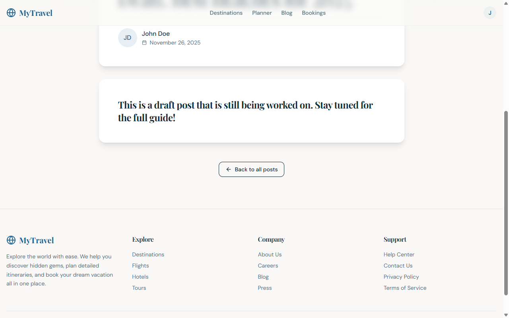 | 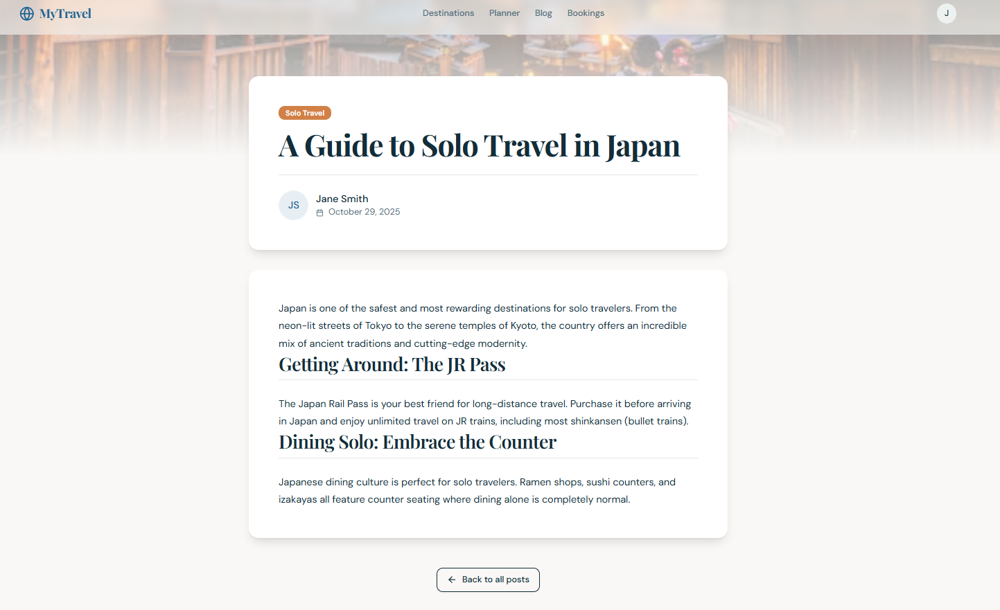 |
| *Full article view* | *Formatted text and images* |

| Blog Editor |
|:-----------:|
| 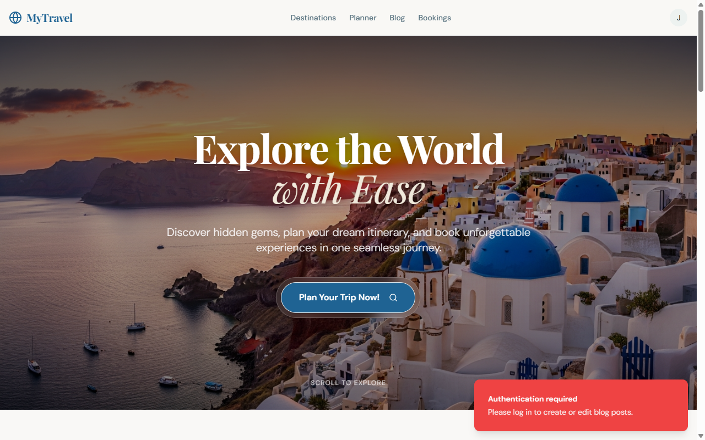 |
| *Lexical rich text editor* |

### Not Found

**Route:** `*` (catch-all)

A custom 404 page is displayed when users navigate to a route that does not exist. The page provides a friendly message and links back to the homepage and other main sections of the site, helping users recover from navigation errors gracefully.

#### Screenshots

| 404 Page |
|:--------:|
|  |
| *Page not found with navigation options* |

## Administrative Pages

The admin section is protected and requires administrator credentials to access. It provides comprehensive tools for managing all aspects of the platform.

### Admin Login

**Route:** `/admin/login`

The administrative login page is separate from the public user login to maintain security isolation. It accepts the admin email and password configured in the application settings. Successful authentication creates an admin session cookie that grants access to all administrative features. Failed login attempts are logged for security monitoring.

#### Screenshots

| Admin Login | Login Error |
|:-----------:|:-----------:|
| 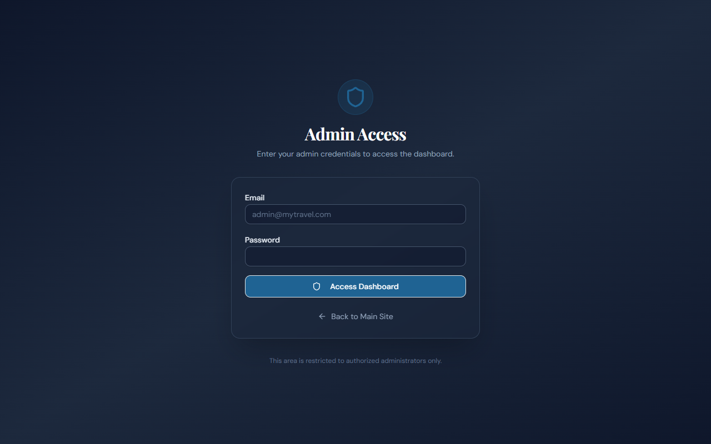 | 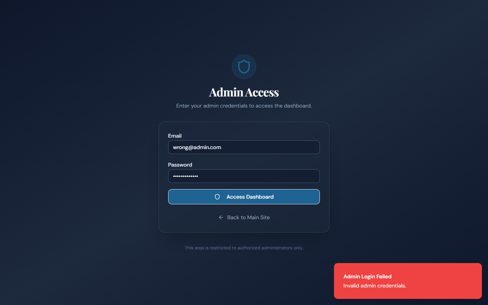 |
| *Administrator authentication* | *Invalid credentials handling* |

### Admin Dashboard

**Route:** `/admin`

The main dashboard provides a centralized overview of platform statistics, analytics, and recent activity. Key performance metrics are displayed prominently, including total registered users, active bookings, published blog posts, and revenue summaries.

**Analytics and Metrics:**
- Visitor traffic statistics
- User registration trends
- Booking volume and revenue charts
- Blog engagement metrics
- Active user sessions

Charts built with Recharts visualize trends over time, helping administrators identify patterns and make data-driven decisions. Quick action buttons provide shortcuts to common administrative tasks such as approving pending bookings or reviewing new user registrations. Recent activity feeds show the latest user actions and system events.

#### Screenshots

| Dashboard Overview |
|:------------------:|
| 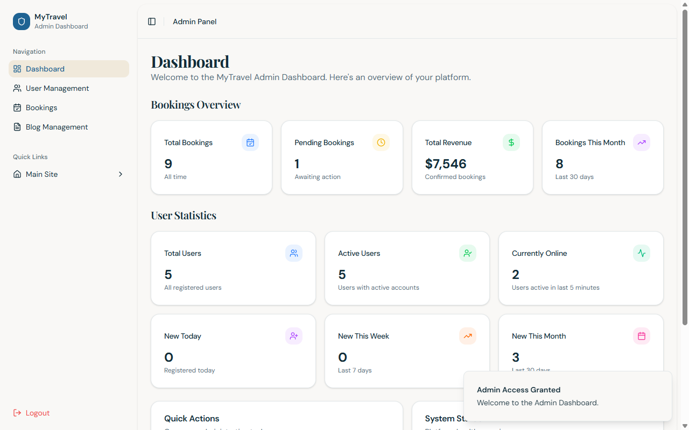 |
| *Main admin interface* |

### User Management

**Route:** `/admin/users`

The user management page displays a searchable, paginated table of all registered users. The search functionality allows administrators to find users by name, email, or other attributes. Pagination controls handle large user bases efficiently.

**Management Capabilities:**
- View detailed user profiles
- Edit user information
- Toggle account active/inactive status
- Delete user accounts
- View registration dates and last login times
- Monitor user activity patterns

Administrators can activate or deactivate accounts as needed for moderation purposes. The interface provides clear visual indicators of account status and important dates.

#### Screenshots

| User List |
|:---------:|
|  |
| *Paginated user table* |

### Booking Management

**Route:** `/admin/bookings`

This page provides complete visibility into all bookings made through the platform. The booking list can be filtered by status categories: pending (awaiting confirmation), confirmed (approved and scheduled), cancelled (user or admin cancelled), and completed (past bookings).

**Management Features:**
- Search bookings by customer name or email
- Filter by booking status
- View detailed booking information
- Update booking status
- Track revenue by period
- Export booking data

Administrators can view comprehensive details for each booking including customer information, itemized services, payment status, and timeline. Status updates trigger notification emails to customers, keeping them informed of any changes.

#### Screenshots

| Booking List |
|:------------:|
|  |
| *All bookings overview* |

### Blog Management

**Route:** `/admin/blog`

The blog management interface provides administrative control over all blog content. The page lists all posts regardless of publication status, giving administrators visibility into both published articles and pending drafts.

**Management Capabilities:**
- View all posts (published and drafts)
- Edit existing content
- Toggle publication status
- Delete posts
- Review content before publication
- Monitor blog statistics

Statistics display engagement metrics for blog content, helping administrators understand which topics resonate with readers. Content moderation tools ensure quality and appropriateness of community contributions.

#### Screenshots

| Post List |
|:---------:|
|  |
| *All posts overview* |

## Search and Filtering

The application provides comprehensive search and filtering capabilities throughout the platform. A global search bar in the navigation allows users to find destinations and blog articles from any page.

**Search Features:**
- Destination search by name or keyword
- Blog article search by title or content
- Real-time search suggestions

**Advanced Filters:**
- Price range sliders
- User rating thresholds
- Seasonal availability (best time to visit)
- Activity type categorization
- Continent and region selection

Filters can be combined to narrow results precisely. Filter selections are preserved during navigation, allowing users to refine their search incrementally.

#### Screenshots

| Filter Panel | Search Results |
|:------------:|:--------------:|
|  |  |
| *Continent, activity, and budget filters* | *Filtered destination results* |

## Core Features

### Responsive Design and Styling

The entire application is built with a visually appealing and user-friendly layout designed to enhance the user experience. High-quality images showcase destinations and create visual appeal throughout the site. Clear typography using modern font stacks ensures readability across all devices.

Responsive design principles implemented with Tailwind CSS ensure the interface adapts seamlessly to different screen sizes. On mobile devices, navigation collapses into an accessible hamburger menu, images resize appropriately, and layouts stack vertically for comfortable scrolling. Tablet and desktop views utilize available screen space with multi-column layouts and expanded navigation.

Intuitive navigation patterns guide users through the site logically. Consistent visual hierarchy helps users understand page structure and find information quickly. Interactive elements provide clear feedback through hover states, focus indicators, and transition animations powered by Framer Motion.

#### Screenshots

| Desktop Layout | Mobile Layout |
|:--------------:|:-------------:|
|  |  |
| *Full desktop experience* | *Mobile-optimized view* |

| Mobile Navigation | Tablet View |
|:-----------------:|:-----------:|
|  | 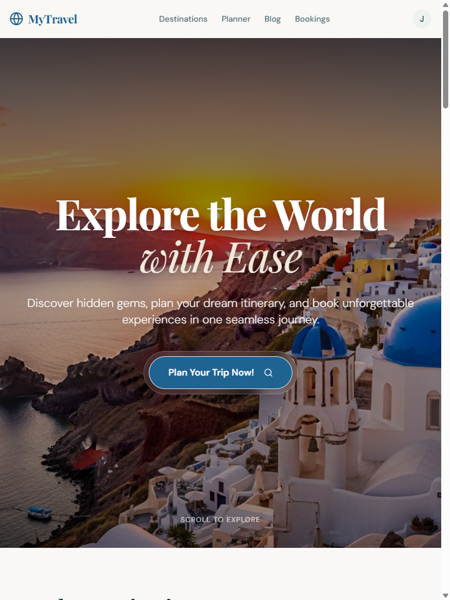 |
| *Hamburger menu expanded* | *Tablet layout* |

### Error Handling

*"Ensure smooth user experiences by providing meaningful error messages."*

The application implements comprehensive error handling to maintain a smooth user experience even when issues occur. Payment failures display clear messages explaining the issue and suggesting resolution steps. Unavailable services are communicated with helpful alternatives when possible.

Network errors are caught and displayed with retry options. Form validation errors appear inline next to the relevant fields with specific guidance on how to correct the input. Server errors are logged for debugging while users see friendly messages that avoid technical jargon.

Toast notifications provide non-intrusive feedback for both successful actions and error conditions. The notification system uses the Sonner library to display consistent, accessible messages that automatically dismiss after an appropriate duration.

For detailed information about error handling implementation, see [Error Handling](./07-ERROR-HANDLING.md).

### Analytics Integration

The application integrates PostHog analytics to track user behavior and optimize the platform experience. Analytics capture page views, feature usage patterns, and conversion metrics while respecting user privacy.

**Tracked Metrics:**
- Page view counts and user flows
- Feature engagement (planner usage, blog reads)
- Booking funnel conversion rates
- Search and filter usage patterns
- Error occurrence frequency

Analytics data informs decisions about content prioritization, feature development, and user experience improvements. The integration is configured to comply with privacy requirements and can be adjusted based on user consent preferences.

#### Screenshots

| Page Analytics |
|:--------------:|
| 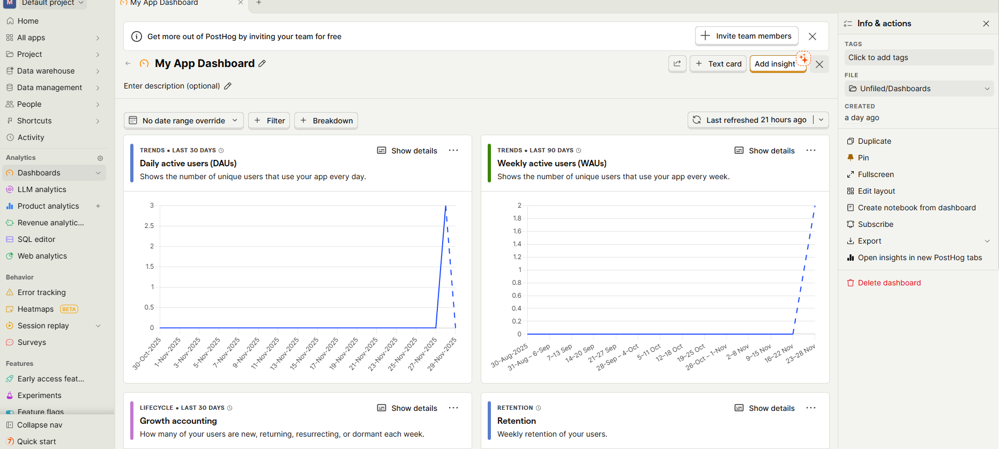 |
| *Page view tracking* |

### Real-time Form Validation

Forms throughout the application provide immediate feedback using react-hook-form integrated with Zod validation schemas. Users see validation errors as they type, helping them correct issues before submission. This client-side validation reduces server load and improves the user experience by providing instant feedback.

Validation rules enforce data quality requirements including email format verification, password strength requirements, required field completion, and logical constraints such as departure dates preceding return dates.

---

[← Back to Documentation](./01-README.md)
