# Architecture

This document provides an overview of the MyTravel application's code structure and organization. The project follows a modern full-stack architecture with a clear separation between the frontend React application and the backend ASP.NET Core API.

## High-Level Architecture

The application consists of two main components that communicate over HTTP. The frontend handles all user interface concerns while the backend manages data persistence, business logic, and authentication.

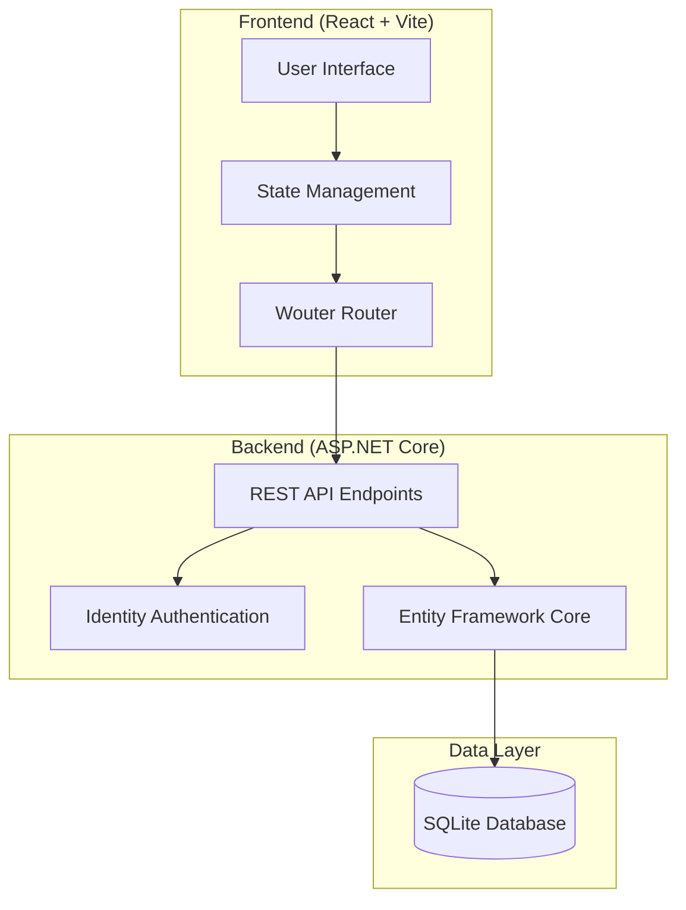

## Request Flow

When a user interacts with the application, requests flow through several layers before reaching the database. This diagram illustrates the typical request lifecycle.

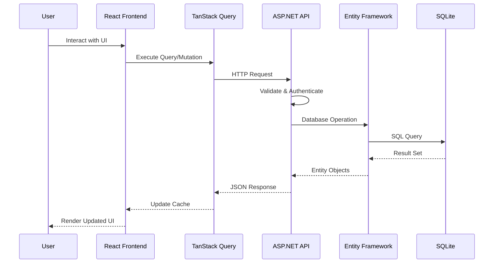

## Frontend Architecture

The frontend is built with React and TypeScript, using Vite as the build tool. The codebase follows a feature-based organization pattern with clear separation of concerns.

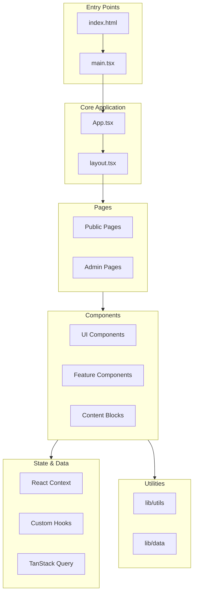

### Frontend Directory Structure

```
mytravel.client/
├── client/
│   ├── index.html                 # HTML entry point
│   ├── public/                    # Static assets (images, fonts)
│   └── src/
│       ├── App.tsx                # Root component with routing
│       ├── main.tsx               # React entry point
│       ├── index.css              # Global styles (Tailwind)
│       │
│       ├── components/            # Reusable components
│       │   ├── admin/             # Admin-specific components
│       │   │   ├── admin-layout.tsx
│       │   │   ├── protected-admin-route.tsx
│       │   │   └── ...
│       │   ├── blocks/            # Content block components
│       │   ├── editor/            # Lexical editor components
│       │   ├── ui/                # Base UI components (55+)
│       │   │   ├── button.tsx
│       │   │   ├── card.tsx
│       │   │   ├── dialog.tsx
│       │   │   └── ...
│       │   ├── booking-form.tsx
│       │   ├── cart-sheet.tsx
│       │   ├── destination-card.tsx
│       │   ├── hero.tsx
│       │   ├── itinerary-planner.tsx
│       │   ├── layout.tsx
│       │   └── trip-summary.tsx
│       │
│       ├── context/               # React context providers
│       │   ├── blog-context.tsx   # Blog state management
│       │   └── cart-context.tsx   # Shopping cart state
│       │
│       ├── hooks/                 # Custom React hooks
│       │   ├── use-admin-auth.tsx # Admin authentication
│       │   ├── use-auth.tsx       # User authentication
│       │   ├── use-mobile.tsx     # Responsive detection
│       │   ├── use-ping.tsx       # Activity tracking
│       │   └── use-toast.ts       # Toast notifications
│       │
│       ├── lib/                   # Utilities and data
│       │   ├── data.ts            # API client functions
│       │   ├── destinations.ts    # Destination data
│       │   ├── mock-data.ts       # Development mock data
│       │   ├── queryClient.ts     # TanStack Query config
│       │   └── utils.ts           # Helper functions
│       │
│       └── pages/                 # Page components
│           ├── admin/             # Admin pages
│           │   ├── admin-blog.tsx
│           │   ├── admin-bookings.tsx
│           │   ├── admin-dashboard.tsx
│           │   ├── admin-login.tsx
│           │   └── admin-users.tsx
│           ├── blog.tsx
│           ├── blog-detail.tsx
│           ├── blog-editor.tsx
│           ├── booking.tsx
│           ├── checkout.tsx
│           ├── destination-details.tsx
│           ├── destinations.tsx
│           ├── home.tsx
│           ├── login.tsx
│           ├── not-found.tsx
│           └── planner.tsx
│
├── attached_assets/               # Generated images
├── components.json                # shadcn/ui configuration
├── eslint.config.js               # ESLint configuration
├── package.json                   # Dependencies and scripts
├── postcss.config.js              # PostCSS configuration
├── tailwind.config.js             # Tailwind CSS configuration
├── tsconfig.json                  # TypeScript configuration
└── vite.config.ts                 # Vite build configuration
```

### Component Hierarchy

This diagram shows the relationship between major frontend components and how they compose to form the user interface.

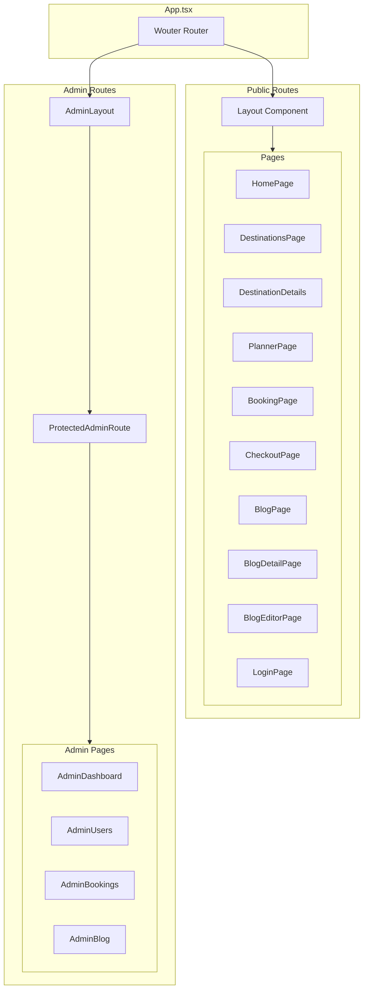

## Backend Architecture

The backend is built with ASP.NET Core using a minimal API approach. It follows a layered architecture with clear separation between endpoints, data access, and business logic.

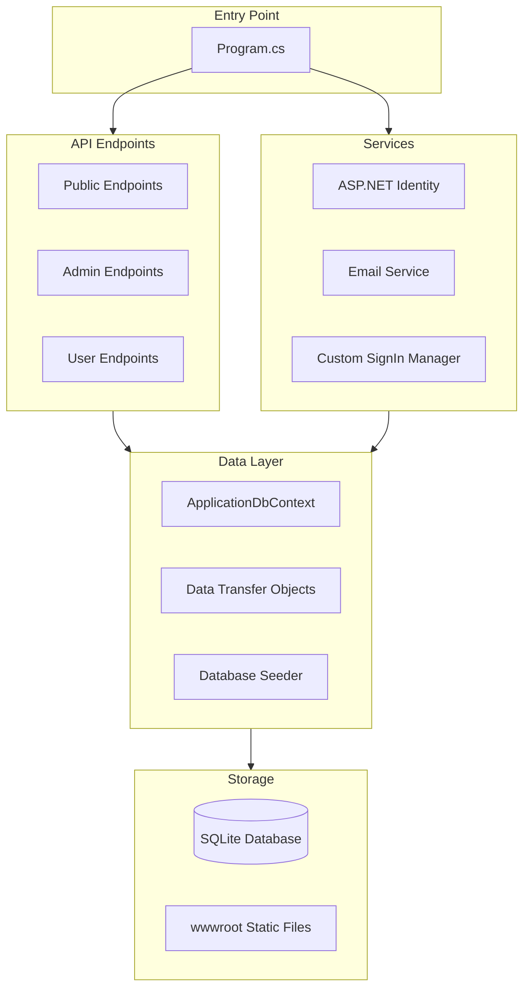

### Backend Directory Structure

```
MyTravel.Server/
├── Program.cs                     # Application entry point
│                                  # - Service configuration
│                                  # - Middleware pipeline
│                                  # - Endpoint registration
│
├── Data/                          # Data access layer
│   ├── ApplicationDbContext.cs    # EF Core context
│   │                              # - DbSet definitions
│   │                              # - Entity configurations
│   │                              # - Model definitions
│   └── DbSeeder.cs                # Database seeding
│                                  # - Sample destinations
│                                  # - Demo blog posts
│                                  # - Admin user creation
│
├── DTOs/                          # Data Transfer Objects
│   ├── BlogDtos.cs                # Blog request/response models
│   ├── BookingDtos.cs             # Booking request/response models
│   ├── UserDtos.cs                # User request/response models
│   └── WeatherForecast.cs         # Sample DTO
│
├── Endpoints/                     # API endpoint definitions
│   ├── ActivityEndpoints.cs       # Ping and heartbeat tracking
│   ├── AdminBlogEndpoints.cs      # Admin blog CRUD operations
│   ├── AdminBookingEndpoints.cs   # Admin booking management
│   ├── AdminEndpoints.cs          # Admin auth and user management
│   ├── BlogEndpoints.cs           # Public blog endpoints
│   ├── BookingEndpoints.cs        # Public booking endpoints
│   ├── UserEndpoints.cs           # User profile endpoints
│   └── WeatherEndpoints.cs        # Sample weather endpoint
│
├── Services/                      # Business logic services
│   ├── CustomSignInManager.cs     # Extended sign-in logic
│   └── EmailSender.cs             # Email sending service
│
├── Properties/
│   └── launchSettings.json        # Development launch profiles
│
├── Views/                         # Server-side views (if any)
│   └── PageBlockTypes/
│
├── wwwroot/                       # Static file serving
│
├── appsettings.json               # Base configuration
├── appsettings.Development.json   # Development configuration
├── MyTravel.Server.csproj         # Project file
└── MyTravel.Server.http           # HTTP request testing
```

### API Endpoint Organization

The API endpoints are organized into logical groups using ASP.NET Core's minimal API pattern with extension methods.

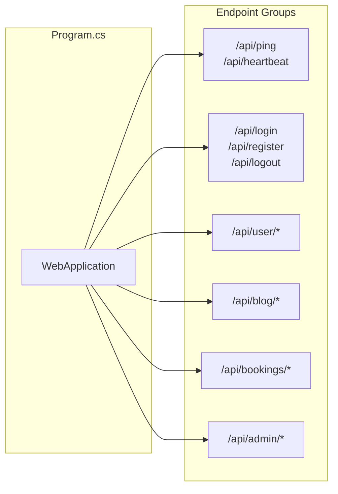

## Data Model

The application uses Entity Framework Core with SQLite for data persistence. The data model centers around users, bookings, and blog content.

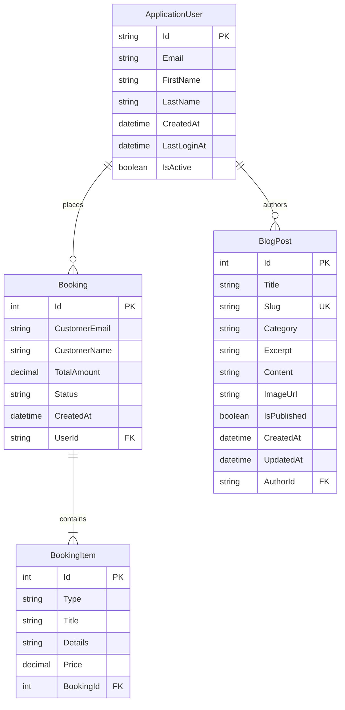

## Authentication Flow

The application implements two separate authentication flows: one for regular users and one for administrators.

### User Authentication

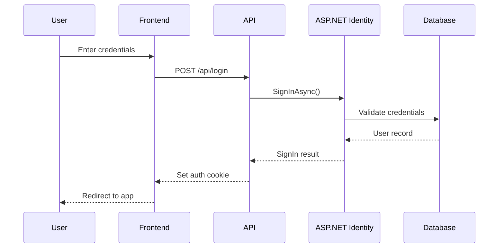

### Admin Authentication

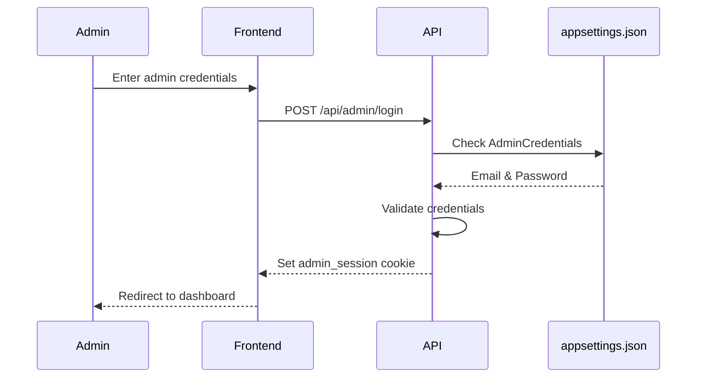

## State Management

The frontend uses a combination of React Context and TanStack Query for state management. Local UI state is managed with React hooks, while server state is cached and synchronized using TanStack Query.

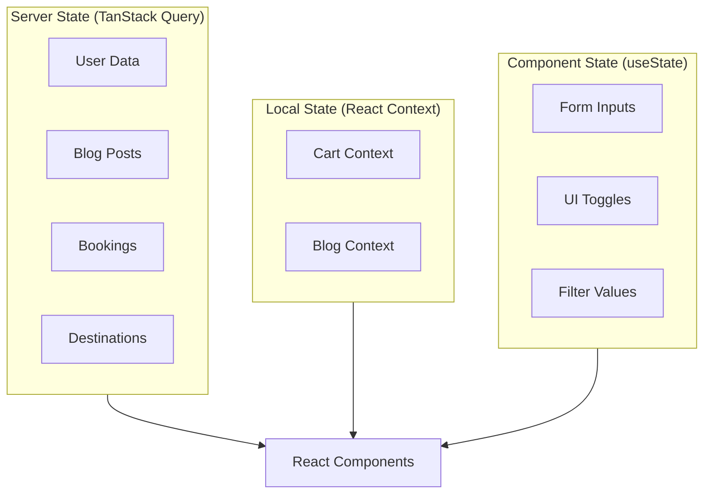

## Build and Deployment

The application uses different build configurations for development and production environments.

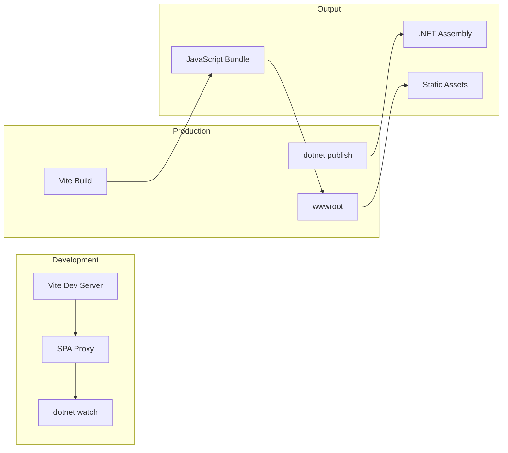

### Development Mode

In development, the Vite development server runs on port 49764 and proxies API requests to the ASP.NET Core server on port 5083. The SPA Proxy middleware automatically starts the Vite server when the .NET application launches.

### Production Mode

For production, Vite builds optimized static assets that are served from the ASP.NET Core wwwroot directory. The .NET application serves both the API and the static frontend files.

---

[← Back to Documentation](./01-README.md)
