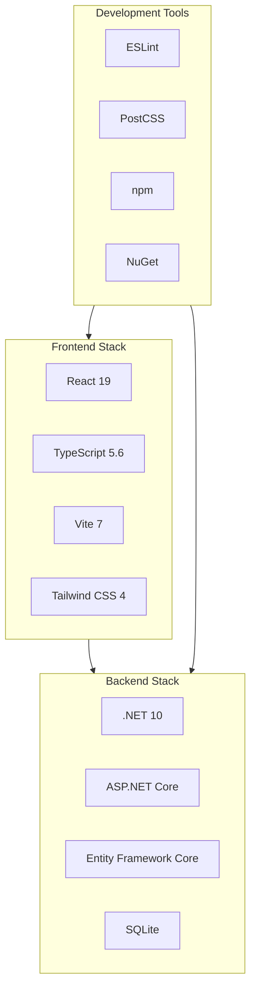

# Technologies

This document provides a comprehensive overview of the libraries, frameworks, and tools used in the MyTravel application. The project leverages modern technologies for both frontend and backend development to deliver a robust and maintainable codebase.

## Technology Stack Overview

## Frontend Technologies

The frontend is built with React and TypeScript, utilizing a modern toolchain for development and production builds.

### Core Framework

| Library | Version | Purpose |
|---------|---------|---------|
| **React** | ^19.2.0 | The core UI library for building component-based user interfaces. React 19 introduces improved performance and new features like automatic batching and concurrent rendering. |
| **React DOM** | ^19.2.0 | Provides DOM-specific methods for rendering React components to the browser. |
| **TypeScript** | 5.6.3 | Adds static typing to JavaScript, enabling better tooling, code navigation, and compile-time error detection. |

### Build Tools

| Library | Version | Purpose |
|---------|---------|---------|
| **Vite** | ^7.1.9 | A modern build tool that provides extremely fast development server startup and hot module replacement (HMR). Vite uses native ES modules during development for instant updates. |
| **@vitejs/plugin-react** | ^4.5.2 | Official Vite plugin for React that enables Fast Refresh and JSX transformation. |
| **ESLint** | ^9.28.0 | A pluggable linting utility for JavaScript and TypeScript. Identifies and reports on patterns found in code to maintain code quality. |
| **PostCSS** | (bundled) | A tool for transforming CSS with JavaScript plugins. Used by Tailwind CSS for processing utility classes. |

### Styling

| Library | Version | Purpose |
|---------|---------|---------|
| **Tailwind CSS** | ^4.1.14 | A utility-first CSS framework that provides low-level utility classes for building custom designs. Enables rapid UI development without leaving HTML. |
| **tailwindcss-animate** | ^1.0.7 | Adds animation utilities to Tailwind CSS for creating smooth transitions and keyframe animations. |
| **class-variance-authority** | ^0.7.1 | A utility for creating variant-based component styles. Simplifies conditional class application. |
| **clsx** | ^2.1.1 | A utility for constructing className strings conditionally. Works well with Tailwind's utility classes. |
| **tailwind-merge** | ^3.3.1 | Intelligently merges Tailwind CSS classes without style conflicts. Prevents duplicate or conflicting utilities. |

### Routing

| Library | Version | Purpose |
|---------|---------|---------|
| **wouter** | ^3.3.5 | A minimalist routing library for React. Provides hooks-based routing with a small footprint (~1.5KB). Chosen for its simplicity and performance over React Router. |

### State Management and Data Fetching

| Library | Version | Purpose |
|---------|---------|---------|
| **@tanstack/react-query** | ^5.60.5 | Powerful data synchronization library for fetching, caching, and updating server state. Handles loading states, error handling, and cache invalidation automatically. |
| **React Context** | (built-in) | Used for local application state like shopping cart and blog editor state. Provides component-level state sharing without external dependencies. |

### UI Components

The application uses Radix UI primitives as the foundation for accessible, unstyled UI components. These are styled with Tailwind CSS to match the application design.

| Library | Version | Purpose |
|---------|---------|---------|
| **@radix-ui/react-accordion** | ^1.2.11 | Collapsible content sections with accessibility support. |
| **@radix-ui/react-alert-dialog** | ^1.1.14 | Modal dialogs for important confirmations and alerts. |
| **@radix-ui/react-aspect-ratio** | ^1.1.7 | Maintains consistent aspect ratios for images and media. |
| **@radix-ui/react-avatar** | ^1.1.10 | User avatar display with fallback support. |
| **@radix-ui/react-checkbox** | ^1.3.2 | Accessible checkbox inputs with custom styling. |
| **@radix-ui/react-collapsible** | ^1.1.11 | Expandable/collapsible content areas. |
| **@radix-ui/react-dialog** | ^1.1.14 | Modal dialog windows for forms and content. |
| **@radix-ui/react-dropdown-menu** | ^2.1.15 | Dropdown menus with keyboard navigation. |
| **@radix-ui/react-hover-card** | ^1.1.14 | Content cards that appear on hover. |
| **@radix-ui/react-label** | ^2.1.7 | Accessible form labels. |
| **@radix-ui/react-menubar** | ^1.1.14 | Application menu bars with submenus. |
| **@radix-ui/react-navigation-menu** | ^1.2.13 | Site navigation with dropdowns. |
| **@radix-ui/react-popover** | ^1.1.14 | Floating content panels anchored to triggers. |
| **@radix-ui/react-progress** | ^1.1.7 | Progress indicators and loading bars. |
| **@radix-ui/react-radio-group** | ^1.3.7 | Radio button groups with accessibility. |
| **@radix-ui/react-scroll-area** | ^1.2.9 | Custom scrollable areas with styled scrollbars. |
| **@radix-ui/react-select** | ^2.2.5 | Custom select dropdowns with search support. |
| **@radix-ui/react-separator** | ^1.1.7 | Visual dividers between content sections. |
| **@radix-ui/react-slider** | ^1.3.5 | Range sliders for numeric input. |
| **@radix-ui/react-slot** | ^1.2.3 | Utility for component composition. |
| **@radix-ui/react-switch** | ^1.2.5 | Toggle switches for boolean settings. |
| **@radix-ui/react-tabs** | ^1.1.12 | Tabbed interfaces for content organization. |
| **@radix-ui/react-toast** | ^1.2.14 | Toast notification system. |
| **@radix-ui/react-toggle** | ^1.1.9 | Toggle buttons for binary states. |
| **@radix-ui/react-toggle-group** | ^1.1.10 | Groups of mutually exclusive toggles. |
| **@radix-ui/react-tooltip** | ^1.2.7 | Informational tooltips on hover. |

### Forms and Validation

| Library | Version | Purpose |
|---------|---------|---------|
| **react-hook-form** | ^7.66.0 | Performant form library with minimal re-renders. Provides form state management, validation, and submission handling. |
| **@hookform/resolvers** | ^5.0.1 | Validation resolvers for react-hook-form. Connects external validation libraries like Zod. |
| **zod** | ^3.25.76 | TypeScript-first schema validation library. Defines validation rules with full type inference. |

### Rich Text Editor

| Library | Version | Purpose |
|---------|---------|---------|
| **lexical** | ^0.38.2 | An extensible text editor framework by Meta. Provides the foundation for the blog post editor with support for rich formatting. |
| **@lexical/react** | ^0.38.2 | React bindings for Lexical editor. |
| **@lexical/rich-text** | ^0.38.2 | Rich text editing capabilities including bold, italic, headings. |
| **@lexical/list** | ^0.38.2 | Ordered and unordered list support. |
| **@lexical/link** | ^0.38.2 | Hyperlink editing and display. |
| **@lexical/code** | ^0.38.2 | Code block formatting. |
| **@lexical/table** | ^0.38.2 | Table editing support. |
| **@lexical/selection** | ^0.38.2 | Text selection utilities. |
| **@lexical/utils** | ^0.38.2 | Common utility functions. |

### Maps and Geolocation

| Library | Version | Purpose |
|---------|---------|---------|
| **leaflet** | ^1.9.4 | Open-source JavaScript library for interactive maps. Provides map rendering, markers, and user interaction. |
| **react-leaflet** | ^5.0.0 | React components for Leaflet maps. Enables declarative map configuration in JSX. |
| **@types/leaflet** | ^1.9.18 | TypeScript type definitions for Leaflet. |

### Drag and Drop

| Library | Version | Purpose |
|---------|---------|---------|
| **@dnd-kit/core** | ^6.3.1 | Core drag and drop functionality. Provides the foundation for the itinerary planner's drag-and-drop interface. |
| **@dnd-kit/sortable** | ^10.0.0 | Sortable list utilities built on dnd-kit. Enables reordering of itinerary items. |
| **@dnd-kit/utilities** | ^3.2.2 | Helper utilities for dnd-kit implementations. |

### Animations

| Library | Version | Purpose |
|---------|---------|---------|
| **framer-motion** | ^12.23.24 | Production-ready animation library for React. Powers page transitions, micro-interactions, and complex animations throughout the application. |

### Charts and Data Visualization

| Library | Version | Purpose |
|---------|---------|---------|
| **recharts** | ^2.15.4 | Composable charting library built on React and D3. Used in the admin dashboard for displaying statistics and trends. |

### Date and Time

| Library | Version | Purpose |
|---------|---------|---------|
| **date-fns** | ^3.6.0 | Modern JavaScript date utility library. Provides functions for parsing, formatting, and manipulating dates. |
| **react-day-picker** | ^8.10.1 | Flexible date picker component. Used for selecting travel dates in booking forms. |

### Icons

| Library | Version | Purpose |
|---------|---------|---------|
| **lucide-react** | ^0.545.0 | Beautiful, consistent icon set with React components. Provides 1000+ icons used throughout the interface. |

### Notifications

| Library | Version | Purpose |
|---------|---------|---------|
| **sonner** | ^2.0.7 | Toast notification library with a clean API. Displays success, error, and informational messages to users. |

### Analytics

| Library | Version | Purpose |
|---------|---------|---------|
| **posthog-js** | ^1.298.1 | Product analytics platform integration. Tracks user behavior, feature usage, and conversion metrics. |

### Utilities

| Library | Version | Purpose |
|---------|---------|---------|
| **cmdk** | ^1.1.1 | Command menu component for keyboard-driven interfaces. |
| **embla-carousel-react** | ^8.6.0 | Carousel/slider component with touch support. |
| **input-otp** | ^1.4.2 | One-time password input component. |
| **next-themes** | ^0.4.6 | Theme switching utility (light/dark mode). |
| **react-resizable-panels** | ^3.0.2 | Resizable panel layouts for complex interfaces. |
| **vaul** | ^1.1.2 | Drawer component for mobile-friendly slide-out panels. |

## Backend Technologies

The backend is built on ASP.NET Core with Entity Framework Core for data access.

### Core Framework

| Package | Version | Purpose |
|---------|---------|---------|
| **.NET** | 10.0 | The runtime and SDK for building the server application. .NET 10 provides the latest performance improvements and language features. |
| **ASP.NET Core** | 10.0 | Web framework for building APIs and web applications. Provides routing, middleware, dependency injection, and HTTP handling. |

### Authentication and Authorization

| Package | Version | Purpose |
|---------|---------|---------|
| **Microsoft.AspNetCore.Identity.EntityFrameworkCore** | 10.0.0 | Identity system for user authentication. Provides user management, password hashing, role-based authorization, and session management. |

### Data Access

| Package | Version | Purpose |
|---------|---------|---------|
| **Microsoft.EntityFrameworkCore.Sqlite** | 10.0.0 | SQLite database provider for Entity Framework Core. Enables file-based database storage without requiring a separate database server. |
| **Microsoft.EntityFrameworkCore.Tools** | 10.0.0 | Command-line tools for EF Core migrations and database management. |

### API Documentation

| Package | Version | Purpose |
|---------|---------|---------|
| **Microsoft.AspNetCore.OpenApi** | 10.0.0 | OpenAPI/Swagger support for API documentation. Automatically generates API documentation from endpoint definitions. |

### Development Tools

| Package | Version | Purpose |
|---------|---------|---------|
| **Microsoft.AspNetCore.SpaProxy** | 10.* | Development proxy for Single Page Applications. Automatically starts the Vite development server when running the .NET application. |

## Development Environment

### Recommended Tools

| Tool | Purpose |
|------|---------|
| **Visual Studio 2022** | Full-featured IDE for .NET development with integrated debugging, testing, and deployment tools. |
| **Visual Studio Code** | Lightweight editor with excellent TypeScript and React support through extensions. |
| **Node.js 18+** | JavaScript runtime required for frontend build tools and development server. |
| **.NET 10 SDK** | Required for building and running the backend application. |

### Browser Support

The application targets modern browsers with ES2020+ support:

- Chrome 90+
- Firefox 90+
- Safari 14+
- Edge 90+

### Development Dependencies

| Library | Version | Purpose |
|---------|---------|---------|
| **@types/react** | ^19.1.8 | TypeScript definitions for React. |
| **@types/react-dom** | ^19.1.6 | TypeScript definitions for React DOM. |
| **@eslint/js** | ^9.28.0 | ESLint core JavaScript rules. |
| **eslint-plugin-react-hooks** | ^5.2.0 | ESLint rules for React Hooks best practices. |
| **eslint-plugin-react-refresh** | ^0.4.20 | ESLint plugin for React Fast Refresh compatibility. |
| **globals** | ^16.2.0 | Global variable definitions for ESLint. |
| **typescript-eslint** | ^8.33.1 | TypeScript support for ESLint. |

---

[← Back to Documentation](./01-README.md)
