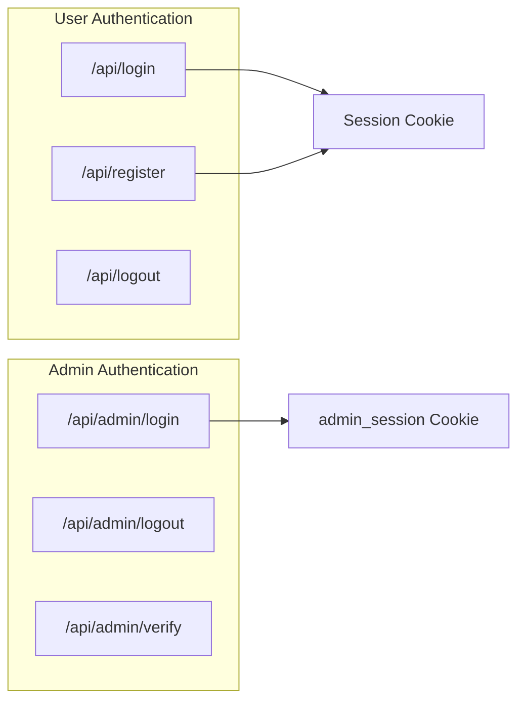
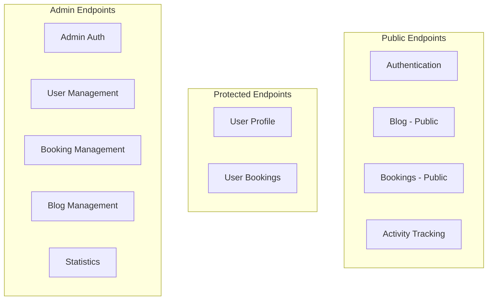

# API Reference

This document provides comprehensive documentation for all API endpoints available in the MyTravel application. The API follows RESTful conventions and returns JSON responses.

## Base URL

```
Development: http://localhost:5083/api
Production: https://your-domain.com/api
```

## Authentication

The API uses cookie-based authentication. There are two authentication mechanisms:

1. **User Authentication** - Managed by ASP.NET Core Identity with session cookies
2. **Admin Authentication** - Uses a separate `admin_session` cookie



## Response Format

All API responses follow a consistent format:

### Success Response

```json
{
  "data": { ... },
  "message": "Operation successful"
}
```

### Error Response

```json
{
  "message": "Error description"
}
```

### Paginated Response

```json
{
  "items": [ ... ],
  "totalCount": 100,
  "page": 1,
  "pageSize": 10,
  "totalPages": 10
}
```

## API Endpoint Groups



---

## Authentication Endpoints

### Register User

Creates a new user account.

```
POST /api/register
```

**Request Body:**

| Field | Type | Required | Description |
|-------|------|----------|-------------|
| `email` | string | Yes | User's email address |
| `password` | string | Yes | Password (min 6 characters, requires uppercase, lowercase, digit, special char) |
| `firstName` | string | No | User's first name |
| `lastName` | string | No | User's last name |

**Example Request:**

```json
{
  "email": "user@example.com",
  "password": "SecurePass123!",
  "firstName": "John",
  "lastName": "Doe"
}
```

**Success Response (200):**

```json
{
  "message": "Registration successful"
}
```

**Error Response (400):**

```json
{
  "message": "Email already registered"
}
```

---

### Login User

Authenticates a user and creates a session.

```
POST /api/login
```

**Request Body:**

| Field | Type | Required | Description |
|-------|------|----------|-------------|
| `email` | string | Yes | User's email address |
| `password` | string | Yes | User's password |

**Example Request:**

```json
{
  "email": "user@example.com",
  "password": "SecurePass123!"
}
```

**Success Response (200):**

Sets authentication cookie and returns:

```json
{
  "message": "Login successful"
}
```

**Error Response (401):**

```json
{
  "message": "Invalid credentials"
}
```

---

### Logout User

Ends the current user session.

```
POST /api/logout
```

**Authentication:** Required

**Success Response (200):**

```json
{}
```

---

## User Endpoints

### Get Current User

Returns basic information about the authenticated user.

```
GET /api/user
```

**Authentication:** Required

**Success Response (200):**

```json
{
  "name": "user@example.com",
  "isAuthenticated": true
}
```

**Error Response (401):**

```json
{
  "message": "Unauthorized"
}
```

---

### Get User Profile

Returns detailed profile information for the authenticated user.

```
GET /api/user/profile
```

**Authentication:** Required

**Success Response (200):**

```json
{
  "id": "user-guid",
  "email": "user@example.com",
  "firstName": "John",
  "lastName": "Doe",
  "fullName": "John Doe"
}
```

---

### Update User Profile

Updates the authenticated user's profile information.

```
PUT /api/user/profile
```

**Authentication:** Required

**Request Body:**

| Field | Type | Required | Description |
|-------|------|----------|-------------|
| `firstName` | string | No | Updated first name |
| `lastName` | string | No | Updated last name |

**Example Request:**

```json
{
  "firstName": "Jonathan",
  "lastName": "Smith"
}
```

**Success Response (200):**

```json
{
  "id": "user-guid",
  "email": "user@example.com",
  "firstName": "Jonathan",
  "lastName": "Smith",
  "fullName": "Jonathan Smith"
}
```

---

## Blog Endpoints (Public)

### Get All Published Blog Posts

Returns a paginated list of published blog posts.

```
GET /api/blog
```

**Query Parameters:**

| Parameter | Type | Default | Description |
|-----------|------|---------|-------------|
| `page` | integer | 1 | Page number |
| `pageSize` | integer | 10 | Items per page |
| `category` | string | null | Filter by category |

**Example Request:**

```
GET /api/blog?page=1&pageSize=10&category=solo-travel
```

**Success Response (200):**

```json
{
  "posts": [
    {
      "id": 1,
      "title": "10 Tips for Solo Travelers",
      "slug": "10-tips-for-solo-travelers",
      "category": "solo-travel",
      "excerpt": "Discover essential tips for your solo adventure...",
      "content": "{\"root\":{...}}",
      "imageUrl": "/images/blog/solo-travel.jpg",
      "published": true,
      "createdAt": "2025-11-01T10:00:00Z",
      "updatedAt": "2025-11-01T10:00:00Z",
      "publishedAt": "2025-11-01T10:00:00Z",
      "author": {
        "id": "author-guid",
        "fullName": "Jane Writer"
      }
    }
  ],
  "totalCount": 25,
  "page": 1,
  "pageSize": 10,
  "totalPages": 3
}
```

---

### Get Blog Post by Slug

Returns a single published blog post by its URL slug.

```
GET /api/blog/{slug}
```

**Path Parameters:**

| Parameter | Type | Description |
|-----------|------|-------------|
| `slug` | string | The URL-friendly post identifier |

**Example Request:**

```
GET /api/blog/10-tips-for-solo-travelers
```

**Success Response (200):**

```json
{
  "id": 1,
  "title": "10 Tips for Solo Travelers",
  "slug": "10-tips-for-solo-travelers",
  "category": "solo-travel",
  "excerpt": "Discover essential tips for your solo adventure...",
  "content": "{\"root\":{...}}",
  "imageUrl": "/images/blog/solo-travel.jpg",
  "published": true,
  "createdAt": "2025-11-01T10:00:00Z",
  "updatedAt": "2025-11-01T10:00:00Z",
  "publishedAt": "2025-11-01T10:00:00Z",
  "author": {
    "id": "author-guid",
    "fullName": "Jane Writer"
  }
}
```

**Error Response (404):**

```json
{
  "message": "Blog post not found"
}
```

---

## Booking Endpoints

### Create Booking

Creates a new booking with one or more items. Supports both authenticated users and guest checkout.

```
POST /api/bookings
```

**Authentication:** Optional (guest checkout supported)

**Request Body:**

| Field | Type | Required | Description |
|-------|------|----------|-------------|
| `customerEmail` | string | Yes* | Customer email (*required for guests) |
| `customerName` | string | Yes* | Customer name (*required for guests) |
| `paymentReference` | string | No | External payment reference |
| `items` | array | Yes | Array of booking items |

**Booking Item Object:**

| Field | Type | Required | Description |
|-------|------|----------|-------------|
| `type` | string | Yes | Item type: `Flight`, `Hotel`, or `Tour` |
| `title` | string | Yes | Item title/name |
| `details` | string | No | Additional details |
| `price` | decimal | Yes | Item price |
| `imageUrl` | string | No | Item image URL |

**Example Request:**

```json
{
  "customerEmail": "guest@example.com",
  "customerName": "Guest User",
  "paymentReference": "PAY-123456",
  "items": [
    {
      "type": "Flight",
      "title": "New York to Paris",
      "details": "Round trip, Economy class",
      "price": 850.00,
      "imageUrl": "/images/flights/nyc-paris.jpg"
    },
    {
      "type": "Hotel",
      "title": "Hotel Le Marais",
      "details": "3 nights, Double room",
      "price": 450.00,
      "imageUrl": "/images/hotels/le-marais.jpg"
    }
  ]
}
```

**Success Response (201):**

```json
{
  "id": 42,
  "message": "Booking created successfully",
  "totalAmount": 1300.00,
  "status": "Confirmed"
}
```

**Error Response (400):**

```json
{
  "message": "At least one booking item is required"
}
```

---

### Get User's Bookings

Returns all bookings for the authenticated user.

```
GET /api/bookings
```

**Authentication:** Required

**Success Response (200):**

```json
{
  "bookings": [
    {
      "id": 42,
      "customerEmail": "user@example.com",
      "customerName": "John Doe",
      "totalAmount": 1300.00,
      "status": "Confirmed",
      "createdAt": "2025-11-15T14:30:00Z",
      "confirmedAt": "2025-11-15T14:30:00Z",
      "cancelledAt": null,
      "paymentReference": "PAY-123456",
      "items": [
        {
          "id": 1,
          "type": "Flight",
          "title": "New York to Paris",
          "details": "Round trip, Economy class",
          "price": 850.00,
          "imageUrl": "/images/flights/nyc-paris.jpg"
        }
      ]
    }
  ]
}
```

---

### Get Booking by ID

Returns a specific booking by ID.

```
GET /api/bookings/{id}
```

**Authentication:** Required (user can only view their own bookings)

**Path Parameters:**

| Parameter | Type | Description |
|-----------|------|-------------|
| `id` | integer | Booking ID |

**Success Response (200):**

```json
{
  "id": 42,
  "customerEmail": "user@example.com",
  "customerName": "John Doe",
  "totalAmount": 1300.00,
  "status": "Confirmed",
  "createdAt": "2025-11-15T14:30:00Z",
  "confirmedAt": "2025-11-15T14:30:00Z",
  "cancelledAt": null,
  "paymentReference": "PAY-123456",
  "items": [ ... ]
}
```

**Error Response (404):**

```json
{
  "message": "Booking not found"
}
```

**Error Response (403):**

Returns `Forbid` if user tries to access another user's booking.

---

## Activity Tracking Endpoints

### Ping (Visitor Tracking)

Tracks anonymous visitor activity. Creates a visitor ID cookie if not present.

```
GET /api/ping
```

**Success Response (200):**

```json
{
  "status": "ok"
}
```

Sets `visitor_id` cookie if not already present.

---

### Heartbeat (User Activity)

Tracks authenticated user activity for real-time online status.

```
POST /api/heartbeat
```

**Authentication:** Optional (only tracks authenticated users)

**Success Response (200):**

```json
{}
```

---

## Admin Authentication Endpoints

### Admin Login

Authenticates an administrator using credentials from configuration.

```
POST /api/admin/login
```

**Request Body:**

| Field | Type | Required | Description |
|-------|------|----------|-------------|
| `email` | string | Yes | Admin email |
| `password` | string | Yes | Admin password |

**Example Request:**

```json
{
  "email": "admin@mytravel.com",
  "password": "Admin@123!"
}
```

**Success Response (200):**

Sets `admin_session` cookie (HttpOnly, Secure, 8-hour expiry) and returns:

```json
{
  "message": "Admin login successful",
  "isAdmin": true
}
```

**Error Response (401):**

Returns `Unauthorized` for invalid credentials.

---

### Admin Logout

Ends the admin session.

```
POST /api/admin/logout
```

**Success Response (200):**

```json
{
  "message": "Admin logged out"
}
```

---

### Verify Admin Session

Checks if the current session has admin privileges.

```
GET /api/admin/verify
```

**Success Response (200):**

```json
{
  "isAdmin": true
}
```

**Error Response (401):**

Returns `Unauthorized` if no valid admin session.

---

## Admin User Management Endpoints

### Get All Users

Returns a paginated, searchable list of all users.

```
GET /api/admin/users
```

**Authentication:** Admin required

**Query Parameters:**

| Parameter | Type | Default | Description |
|-----------|------|---------|-------------|
| `page` | integer | 1 | Page number |
| `pageSize` | integer | 10 | Items per page |
| `search` | string | null | Search by username or email |
| `sortBy` | string | "createdAt" | Sort field: `username`, `email`, `createdAt`, `lastLoginAt` |
| `sortOrder` | string | "desc" | Sort direction: `asc` or `desc` |

**Example Request:**

```
GET /api/admin/users?page=1&pageSize=20&search=john&sortBy=createdAt&sortOrder=desc
```

**Success Response (200):**

```json
{
  "users": [
    {
      "id": "user-guid",
      "userName": "john@example.com",
      "email": "john@example.com",
      "createdAt": "2025-10-01T08:00:00Z",
      "lastLoginAt": "2025-11-28T09:30:00Z",
      "isActive": true,
      "emailConfirmed": true
    }
  ],
  "totalCount": 150,
  "page": 1,
  "pageSize": 20,
  "totalPages": 8
}
```

---

### Get User by ID

Returns detailed information for a specific user.

```
GET /api/admin/users/{id}
```

**Authentication:** Admin required

**Path Parameters:**

| Parameter | Type | Description |
|-----------|------|-------------|
| `id` | string | User ID (GUID) |

**Success Response (200):**

```json
{
  "id": "user-guid",
  "userName": "john@example.com",
  "email": "john@example.com",
  "createdAt": "2025-10-01T08:00:00Z",
  "lastLoginAt": "2025-11-28T09:30:00Z",
  "isActive": true,
  "emailConfirmed": true
}
```

**Error Response (404):**

```json
{
  "message": "User not found"
}
```

---

### Update User

Updates a user's information.

```
PUT /api/admin/users/{id}
```

**Authentication:** Admin required

**Request Body:**

| Field | Type | Required | Description |
|-------|------|----------|-------------|
| `userName` | string | No | New username |
| `isActive` | boolean | No | Active status |
| `emailConfirmed` | boolean | No | Email confirmation status |

**Example Request:**

```json
{
  "userName": "john.doe@example.com",
  "isActive": true,
  "emailConfirmed": true
}
```

**Success Response (200):**

```json
{
  "message": "User updated successfully",
  "user": {
    "id": "user-guid",
    "userName": "john.doe@example.com",
    "email": "john@example.com",
    "createdAt": "2025-10-01T08:00:00Z",
    "lastLoginAt": "2025-11-28T09:30:00Z",
    "isActive": true,
    "emailConfirmed": true
  }
}
```

---

### Toggle User Status

Toggles a user's active/inactive status.

```
PATCH /api/admin/users/{id}/toggle-status
```

**Authentication:** Admin required

**Success Response (200):**

```json
{
  "message": "User deactivated successfully",
  "isActive": false
}
```

---

### Delete User

Permanently deletes a user account.

```
DELETE /api/admin/users/{id}
```

**Authentication:** Admin required

**Success Response (200):**

```json
{
  "message": "User deleted successfully"
}
```

**Error Response (400):**

```json
{
  "message": "Failed to delete user",
  "errors": [ ... ]
}
```

---

### Get Admin Statistics

Returns platform-wide statistics for the admin dashboard.

```
GET /api/admin/stats
```

**Authentication:** Admin required

**Success Response (200):**

```json
{
  "totalUsers": 1250,
  "activeUsersCount": 1180,
  "currentlyOnline": 45,
  "newUsersToday": 12,
  "newUsersThisWeek": 87,
  "newUsersThisMonth": 320
}
```

---

## Admin Booking Management Endpoints

### Get All Bookings

Returns a paginated list of all bookings with filtering and sorting.

```
GET /api/admin/bookings
```

**Authentication:** Admin required

**Query Parameters:**

| Parameter | Type | Default | Description |
|-----------|------|---------|-------------|
| `page` | integer | 1 | Page number |
| `pageSize` | integer | 10 | Items per page |
| `search` | string | null | Search by email, name, or booking ID |
| `status` | string | null | Filter by status: `Pending`, `Confirmed`, `Cancelled`, `Completed` |
| `sortBy` | string | "createdAt" | Sort field: `customerName`, `customerEmail`, `totalAmount`, `status`, `createdAt` |
| `sortOrder` | string | "desc" | Sort direction: `asc` or `desc` |

**Success Response (200):**

```json
{
  "bookings": [
    {
      "id": 42,
      "customerEmail": "user@example.com",
      "customerName": "John Doe",
      "totalAmount": 1300.00,
      "status": "Confirmed",
      "createdAt": "2025-11-15T14:30:00Z",
      "confirmedAt": "2025-11-15T14:30:00Z",
      "cancelledAt": null,
      "paymentReference": "PAY-123456",
      "items": [ ... ]
    }
  ],
  "totalCount": 500,
  "page": 1,
  "pageSize": 10,
  "totalPages": 50
}
```

---

### Get Booking by ID (Admin)

Returns detailed booking information.

```
GET /api/admin/bookings/{id}
```

**Authentication:** Admin required

**Success Response (200):**

Same structure as user booking response.

---

### Update Booking Status

Updates the status of a booking.

```
PATCH /api/admin/bookings/{id}/status
```

**Authentication:** Admin required

**Request Body:**

| Field | Type | Required | Description |
|-------|------|----------|-------------|
| `status` | string | Yes | New status: `Pending`, `Confirmed`, `Cancelled`, `Completed` |

**Example Request:**

```json
{
  "status": "Completed"
}
```

**Success Response (200):**

```json
{
  "message": "Booking status updated successfully",
  "id": 42,
  "status": "Completed"
}
```

**Error Response (400):**

```json
{
  "message": "Invalid status value"
}
```

---

### Get Booking Statistics

Returns booking-related statistics.

```
GET /api/admin/bookings/stats
```

**Authentication:** Admin required

**Success Response (200):**

```json
{
  "totalBookings": 500,
  "pendingBookings": 25,
  "confirmedBookings": 350,
  "cancelledBookings": 50,
  "completedBookings": 75,
  "totalRevenue": 425000.00,
  "bookingsToday": 8,
  "bookingsThisWeek": 45,
  "bookingsThisMonth": 180
}
```

---

## Admin Blog Management Endpoints

### Get All Blog Posts (Admin)

Returns all blog posts including drafts with filtering and sorting.

```
GET /api/admin/blog
```

**Authentication:** Admin required

**Query Parameters:**

| Parameter | Type | Default | Description |
|-----------|------|---------|-------------|
| `page` | integer | 1 | Page number |
| `pageSize` | integer | 10 | Items per page |
| `search` | string | null | Search in title or excerpt |
| `category` | string | null | Filter by category |
| `status` | string | null | Filter: `published` or `draft` |
| `sortBy` | string | "createdAt" | Sort field: `title`, `category`, `published`, `publishedAt`, `createdAt` |
| `sortOrder` | string | "desc" | Sort direction: `asc` or `desc` |

**Success Response (200):**

```json
{
  "posts": [
    {
      "id": 1,
      "title": "Draft Post",
      "slug": "draft-post",
      "category": "adventure",
      "excerpt": "This is a draft...",
      "content": "{...}",
      "imageUrl": null,
      "published": false,
      "createdAt": "2025-11-20T10:00:00Z",
      "updatedAt": "2025-11-20T10:00:00Z",
      "publishedAt": null,
      "author": null
    }
  ],
  "totalCount": 30,
  "page": 1,
  "pageSize": 10,
  "totalPages": 3
}
```

---

### Get Blog Post by ID (Admin)

Returns a specific blog post by ID (including drafts).

```
GET /api/admin/blog/{id}
```

**Authentication:** Admin required

**Success Response (200):**

Same structure as public blog post response.

---

### Create Blog Post

Creates a new blog post.

```
POST /api/admin/blog
```

**Authentication:** Admin required

**Request Body:**

| Field | Type | Required | Description |
|-------|------|----------|-------------|
| `title` | string | Yes | Post title |
| `authorId` | string | No | Author user ID |
| `category` | string | No | Category (default: "solo-travel") |
| `excerpt` | string | No | Short description |
| `content` | string | Yes | Lexical editor JSON content |
| `imageUrl` | string | No | Featured image URL |
| `published` | boolean | No | Publish immediately (default: false) |

**Example Request:**

```json
{
  "title": "New Adventure Guide",
  "category": "adventure",
  "excerpt": "Discover the best adventure destinations...",
  "content": "{\"root\":{\"children\":[...]}}",
  "imageUrl": "/images/blog/adventure.jpg",
  "published": false
}
```

**Success Response (201):**

```json
{
  "id": 15,
  "slug": "new-adventure-guide",
  "message": "Blog post created successfully"
}
```

**Error Response (400):**

```json
{
  "message": "Title is required"
}
```

---

### Update Blog Post

Updates an existing blog post.

```
PUT /api/admin/blog/{id}
```

**Authentication:** Admin required

**Request Body:**

| Field | Type | Required | Description |
|-------|------|----------|-------------|
| `title` | string | No | Updated title (regenerates slug) |
| `category` | string | No | Updated category |
| `excerpt` | string | No | Updated excerpt |
| `content` | string | No | Updated content |
| `imageUrl` | string | No | Updated image URL |
| `published` | boolean | No | Publication status |

**Success Response (200):**

```json
{
  "message": "Blog post updated successfully",
  "id": 15,
  "slug": "updated-adventure-guide"
}
```

---

### Delete Blog Post

Permanently deletes a blog post.

```
DELETE /api/admin/blog/{id}
```

**Authentication:** Admin required

**Success Response (200):**

```json
{
  "message": "Blog post deleted successfully"
}
```

---

### Toggle Blog Post Publication

Toggles the published/draft status of a blog post.

```
PATCH /api/admin/blog/{id}/toggle-publish
```

**Authentication:** Admin required

**Success Response (200):**

```json
{
  "message": "Blog post published successfully",
  "published": true
}
```

---

### Get Blog Statistics

Returns blog-related statistics.

```
GET /api/admin/blog/stats
```

**Authentication:** Admin required

**Success Response (200):**

```json
{
  "totalPosts": 30,
  "publishedPosts": 25,
  "draftPosts": 5,
  "postsThisWeek": 3,
  "postsThisMonth": 12,
  "postsByCategory": [
    { "category": "solo-travel", "count": 10 },
    { "category": "adventure", "count": 8 },
    { "category": "family-trips", "count": 7 },
    { "category": "luxury-travel", "count": 5 }
  ]
}
```

---

## HTTP Status Codes

| Code | Description |
|------|-------------|
| `200` | OK - Request successful |
| `201` | Created - Resource created successfully |
| `400` | Bad Request - Invalid input or validation error |
| `401` | Unauthorized - Authentication required or failed |
| `403` | Forbidden - Access denied to resource |
| `404` | Not Found - Resource does not exist |
| `500` | Internal Server Error - Server-side error |

## Rate Limiting

The API does not currently implement rate limiting. For production deployments, consider implementing rate limiting at the reverse proxy level.

## CORS

Cross-Origin Resource Sharing (CORS) is configured to allow requests from the frontend development server during development. In production, CORS should be configured to allow only trusted origins.

---

[← Back to Documentation](./01-README.md)
