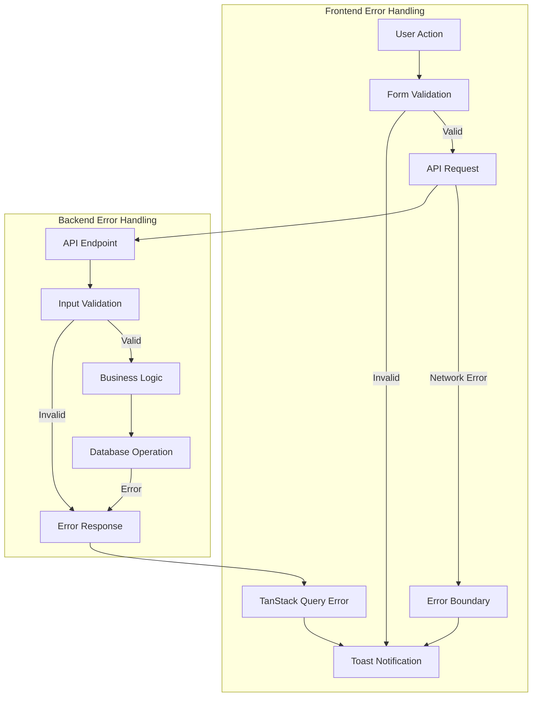
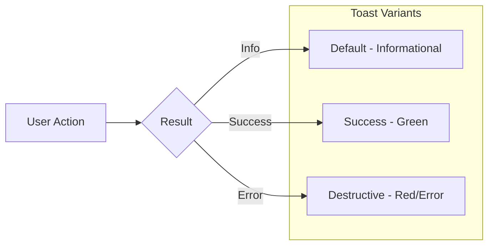
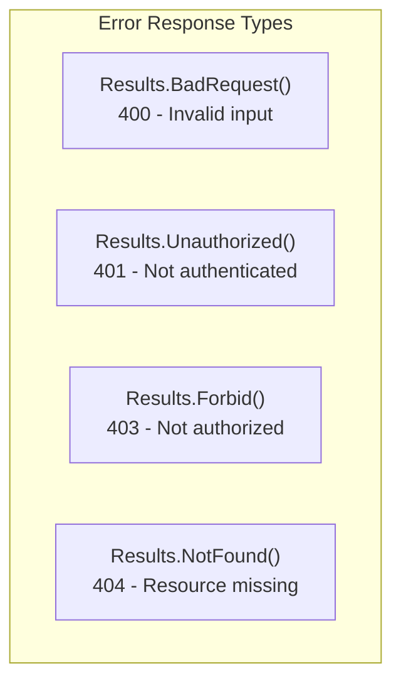
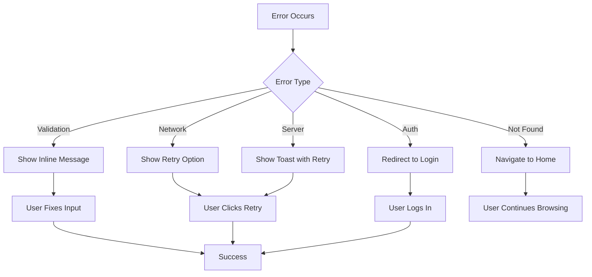

# Error Handling

This document explains the error handling strategies implemented throughout the MyTravel application. Comprehensive error handling ensures users receive meaningful feedback when issues occur, maintaining a smooth experience even during failures.

## Error Handling Philosophy

*"Ensure smooth user experiences by providing meaningful error messages."*

The application follows these core principles for error handling:

1. **User-Friendly Messages** - Technical errors are translated into understandable language
2. **Graceful Degradation** - The application remains functional even when individual features fail
3. **Appropriate Feedback** - Users receive timely notifications about the success or failure of their actions
4. **Logging for Debugging** - Errors are captured for developer troubleshooting without exposing sensitive details to users

## Error Flow Architecture



---

## Frontend Error Handling

### API Request Helper

The application uses a centralized API request function that standardizes error handling for all HTTP requests. This is implemented in `lib/queryClient.ts`.

```typescript
async function throwIfResNotOk(res: Response) {
  if (!res.ok) {
    const text = (await res.text()) || res.statusText;
    throw new Error(`${res.status}: ${text}`);
  }
}

export async function apiRequest(
  method: string,
  url: string,
  data?: unknown | undefined,
): Promise<Response> {
  const res = await fetch(url, {
    method,
    headers: data ? { "Content-Type": "application/json" } : {},
    body: data ? JSON.stringify(data) : undefined,
    credentials: "include",
  });

  await throwIfResNotOk(res);
  return res;
}
```

This helper function:
- Checks if the response status indicates an error (`!res.ok`)
- Extracts the error message from the response body or uses the status text
- Throws an `Error` with both the status code and message for handling upstream

### TanStack Query Error Handling

TanStack Query is configured with custom error handling behavior in `queryClient.ts`:

```typescript
type UnauthorizedBehavior = "returnNull" | "throw";

export const getQueryFn: <T>(options: {
  on401: UnauthorizedBehavior;
}) => QueryFunction<T> =
  ({ on401: unauthorizedBehavior }) =>
  async ({ queryKey }) => {
    const res = await fetch(queryKey.join("/") as string, {
      credentials: "include",
    });

    if (unauthorizedBehavior === "returnNull" && res.status === 401) {
      return null;
    }

    await throwIfResNotOk(res);
    return await res.json();
  };

export const queryClient = new QueryClient({
  defaultOptions: {
    queries: {
      queryFn: getQueryFn({ on401: "throw" }),
      refetchInterval: false,
      refetchOnWindowFocus: false,
      staleTime: Infinity,
      retry: false,
    },
    mutations: {
      retry: false,
    },
  },
});
```

Key configuration choices:
- **401 Handling** - Configurable behavior for unauthorized responses (return null or throw)
- **No Automatic Retry** - Failed requests are not automatically retried to prevent redundant server load
- **No Refetch on Focus** - Prevents unexpected data refreshes when switching browser tabs

### Mutation Error Handling Pattern

When performing mutations (create, update, delete operations), errors are handled in the `onError` callback:

```typescript
const mutation = useMutation({
  mutationFn: async (data: FormData) => {
    const response = await apiRequest("POST", "/api/bookings", data);
    return response.json();
  },
  onSuccess: (data) => {
    toast({
      title: "Success",
      description: "Your booking has been confirmed!",
    });
    // Navigate or update UI
  },
  onError: (error: Error) => {
    toast({
      title: "Booking Failed",
      description: error.message || "Unable to complete your booking. Please try again.",
      variant: "destructive",
    });
  },
});
```

### Toast Notification System

The application uses a toast notification system (Sonner/Radix Toast) for user feedback. Toasts support multiple variants for different message types.



**Toast Usage Examples:**

```typescript
// Success notification
toast({
  title: "Profile Updated",
  description: "Your changes have been saved successfully.",
});

// Error notification
toast({
  title: "Error",
  description: "Failed to save changes. Please try again.",
  variant: "destructive",
});

// Informational notification
toast({
  title: "Session Expiring",
  description: "Your session will expire in 5 minutes.",
});
```

### Form Validation with Zod

Forms use react-hook-form with Zod schemas for client-side validation. This catches errors before they reach the server.

```typescript
import { useForm } from "react-hook-form";
import { zodResolver } from "@hookform/resolvers/zod";
import { z } from "zod";

const loginSchema = z.object({
  email: z.string().email("Please enter a valid email address"),
  password: z.string().min(6, "Password must be at least 6 characters"),
});

type LoginForm = z.infer<typeof loginSchema>;

function LoginPage() {
  const form = useForm<LoginForm>({
    resolver: zodResolver(loginSchema),
    defaultValues: {
      email: "",
      password: "",
    },
  });

  const onSubmit = async (data: LoginForm) => {
    try {
      await apiRequest("POST", "/api/login", data);
      // Handle success
    } catch (error) {
      form.setError("root", {
        message: "Invalid email or password",
      });
    }
  };

  return (
    <Form {...form}>
      <FormField
        control={form.control}
        name="email"
        render={({ field }) => (
          <FormItem>
            <FormLabel>Email</FormLabel>
            <FormControl>
              <Input {...field} />
            </FormControl>
            <FormMessage /> {/* Displays validation errors */}
          </FormItem>
        )}
      />
      {/* ... */}
    </Form>
  );
}
```

**Validation Error Display:**

| State | User Experience |
|-------|-----------------|
| Empty required field | "This field is required" appears below input |
| Invalid email format | "Please enter a valid email address" |
| Password too short | "Password must be at least 6 characters" |
| Server validation error | Error message displayed at form level |

### 404 Not Found Page

The application includes a custom 404 page for handling invalid routes:

```typescript
// pages/not-found.tsx
export default function NotFound() {
  return (
    <div className="flex flex-col items-center justify-center min-h-screen">
      <h1 className="text-6xl font-bold text-gray-900">404</h1>
      <p className="text-xl text-gray-600 mt-4">Page not found</p>
      <p className="text-gray-500 mt-2">
        The page you're looking for doesn't exist or has been moved.
      </p>
      <Link href="/" className="mt-6">
        <Button>Return to Homepage</Button>
      </Link>
    </div>
  );
}
```

---

## Backend Error Handling

### Standardized Error Responses

The backend uses ASP.NET Core's `Results` class to return consistent error responses:



**Error Response Examples:**

```csharp
// 400 Bad Request - Validation errors
if (string.IsNullOrWhiteSpace(request.Title))
{
    return Results.BadRequest(new { message = "Title is required" });
}

if (request.Items == null || request.Items.Count == 0)
{
    return Results.BadRequest(new { message = "At least one booking item is required" });
}

// 401 Unauthorized - Authentication required
var adminCookie = httpContext.Request.Cookies["admin_session"];
if (adminCookie != "authenticated")
{
    return Results.Unauthorized();
}

// 403 Forbidden - Access denied
if (booking.UserId != null && booking.UserId != userId)
{
    return Results.Forbid();
}

// 404 Not Found - Resource doesn't exist
var post = await db.BlogPosts.FindAsync(id);
if (post == null)
{
    return Results.NotFound(new { message = "Blog post not found" });
}
```

### Input Validation

All API endpoints validate input before processing:

```csharp
// Booking endpoint validation
app.MapPost("/api/bookings", async (CreateBookingRequest request, ...) =>
{
    // Validate required items
    if (request.Items == null || request.Items.Count == 0)
    {
        return Results.BadRequest(new { message = "At least one booking item is required" });
    }

    // Validate guest checkout requirements
    if (user.Identity?.IsAuthenticated != true)
    {
        if (string.IsNullOrWhiteSpace(request.CustomerEmail) || 
            string.IsNullOrWhiteSpace(request.CustomerName))
        {
            return Results.BadRequest(new { 
                message = "Customer email and name are required for guest checkout" 
            });
        }
    }

    // Validate enum values
    if (!Enum.TryParse<BookingStatus>(request.Status, true, out var statusEnum))
    {
        return Results.BadRequest(new { message = "Invalid status value" });
    }

    // ... proceed with valid request
});
```

### Non-Critical Operation Error Handling

For operations that shouldn't block the main request (like sending emails), errors are caught and logged but don't fail the overall operation:

```csharp
// Create booking
db.Bookings.Add(booking);
await db.SaveChangesAsync();

// Try to send confirmation email (non-critical)
try
{
    await emailSender.SendConfirmationLinkAsync(
        new ApplicationUser { Email = booking.CustomerEmail },
        booking.CustomerEmail,
        emailBody);
}
catch
{
    // Email sending failed, but booking was created successfully
    // Log the error for investigation but don't fail the request
}

// Return success - booking was created
return Results.Created($"/api/bookings/{booking.Id}", new
{
    id = booking.Id,
    message = "Booking created successfully"
});
```

### Authentication Error Handling

The admin authentication system validates credentials against configuration:

```csharp
app.MapPost("/api/admin/login", async (
    AdminLoginRequest request,
    IConfiguration config,
    HttpContext httpContext) =>
{
    var adminEmail = config["AdminCredentials:Email"];
    var adminPassword = config["AdminCredentials:Password"];

    if (request.Email == adminEmail && request.Password == adminPassword)
    {
        // Set secure cookie and return success
        httpContext.Response.Cookies.Append("admin_session", "authenticated", 
            new CookieOptions
            {
                HttpOnly = true,
                Secure = true,
                SameSite = SameSiteMode.Strict,
                Expires = DateTimeOffset.UtcNow.AddHours(8)
            });

        return Results.Ok(new { message = "Admin login successful", isAdmin = true });
    }

    // Invalid credentials - return 401 without revealing which field was wrong
    return Results.Unauthorized();
});
```

### Database Error Handling

Entity Framework operations are wrapped in appropriate error handling:

```csharp
// Delete user with Identity Manager (handles cascading constraints)
var result = await userManager.DeleteAsync(user);
if (!result.Succeeded)
{
    return Results.BadRequest(new { 
        message = "Failed to delete user", 
        errors = result.Errors 
    });
}

return Results.Ok(new { message = "User deleted successfully" });
```

---

## Error Scenarios and User Experience

### Common Error Scenarios

| Scenario | Frontend Handling | Backend Response | User Message |
|----------|-------------------|------------------|--------------|
| Invalid form input | Inline validation message | N/A (client-side) | "Please enter a valid email address" |
| Wrong password | Toast notification | 401 Unauthorized | "Invalid email or password" |
| Session expired | Redirect to login | 401 Unauthorized | "Your session has expired. Please log in again." |
| Resource not found | 404 page or toast | 404 Not Found | "The requested item could not be found" |
| Network error | Toast notification | N/A | "Unable to connect. Please check your internet connection." |
| Server error | Toast notification | 500 Internal Error | "Something went wrong. Please try again later." |
| Payment failure | Toast + form state | 400 Bad Request | "Payment could not be processed. Please verify your payment details." |
| Booking unavailable | Toast notification | 400 Bad Request | "This booking is no longer available" |

### Error Recovery Patterns



---

## Best Practices Summary

### Frontend

1. **Always handle errors in mutations** - Use `onError` callbacks to display user feedback
2. **Validate before submitting** - Use Zod schemas with react-hook-form
3. **Provide specific messages** - Tell users what went wrong and how to fix it
4. **Use appropriate toast variants** - `destructive` for errors, default for success
5. **Handle loading states** - Show spinners/skeletons during async operations

### Backend

1. **Return appropriate status codes** - 400 for validation, 401 for auth, 404 for missing resources
2. **Include helpful messages** - Explain what went wrong in the response body
3. **Don't expose sensitive information** - Avoid revealing system internals in error messages
4. **Handle non-critical failures gracefully** - Don't fail the whole request if email sending fails
5. **Validate all input** - Never trust client-side validation alone

---

[← Back to Documentation](./01-README.md)
